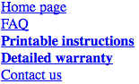

# 选择器，特度和层叠

# 1、选择器

CSS的一个主要优势——尤其对设计者而言——是它能够轻松地把一组样式应用到同一类型的所有元素。印象不够深刻？想象这样的场景：通过编辑单行CSS，你可以修改所有标题的颜色。不喜欢正在使用的蓝色？修改一行代码，把它们都变成紫色、黄色、栗色等等任何想要的颜色。这可以让你，设计师，专注于设计而不是繁琐的工作。下次会议中，有人想看绿色标题，你只需要编辑样式然而点击重新加载。瞧!几秒钟就完成了，每个人都可以看到。

当然，CSS不能解决所有问题——比如，它不能用来改变PNG图片的颜色空间，至少现在还不能——但它确实让全局修改变得容易多了。我们先从选择器和结构开始。

## 基本样式规则

如上所述，CSS的核心特性是将某些样式应用于文档中的整个元素类型的能力。例如，如果你想把所有`h2`元素的文本显示为灰色，使用老套的HTML，你必须在所有的`h2`元素中插入`...`标签：

~~~html
<h2>This is h2 text</h2>
~~~

显然，如果你的文档里面有许多`h2`元素，修改过程将是乏味的。更糟糕的是，如果你之后又想把所有的`h2`从灰色变成绿色，你又得重新开始手动设置一遍便签。（没错，以前就是这么干的！）

CSS让你可以创建易于编辑的规则，并把它们应用于所有你定义的文本元素（下一部分将解释规则如何生效）。例如，简单地写一次下面的规则，把所有的`h2`元素都变成灰色：

~~~css
h2 {color: gray;}
~~~

如果你想把所有`h2`的文本变成另一种颜色——比如银色——只要简单地选择（属性）值：

~~~css
h2 {color: silver;}
~~~

### 元素选择器

元素选择器通常都是HTML元素，但也有例外。例如，如果CSS文件的样式是用于XML文档的，元素选择器可能会是这样：

~~~css
QUOTE {color: gray;}  
BIB {color: red;}  
BOOKTITLE {color: purple;}  
MYElement {color: red;}
~~~

换句话说，文档的元素被用作最基本的选择器。在XML中，选择器可以是任何东西，因为XML允许创建新的标记语言，任何东西都可以作为元素名称。另一方面，如果为HTML文档添加样式，选择器一般是许多HTML元素之一，如`p`，`h3`，`em`，`a`,甚至`html`元素本身。例如：

~~~css
html {color: black;}  
h1 {color: gray;}  
h2 {color: silver;}
~~~

样式表的结果在图1-1中展示：

*图1-1：简单文档的简单样式*

当你直接全局地给元素设置了样式，你可以把样式从一个样式移到另一个样式上。如果你想要图1-1中的段落文本而不是`h1`元素是灰色，没问题，只要把`h1`选择器换成`p`就行了;

~~~css
html {color: black;}  
p {color: gray;}  
h2 {color: silver;}
~~~

结果在图1-2中展示:

*图1-2：把样式从一个元素移到另一个上*

### 声明和关键字

声明块包含一或多条声明。一条声明的格式总是一个**属性**后面跟着一个冒号，然后一个**值**后面跟着一个分号。冒号和分号后面可以有零或多个空白。几乎所有的值都是单个关键字或者空白分隔的当前属性允许的多个关键字列表。如果在一条声明中使用了错误的属性或值，整条规则都会被忽略。因此，下面这两条声明是无效的：

~~~css
brain-size: 2cm; /* unknown property 'brain-size' */  
color: ultraviolet; /* unknown value 'ultraviolet' */
~~~

属性值可以使用多个关键字的时候，关键字通常用空白分隔。很多属性可以接收多个关键字（如`font`属性），但不是全部属性都可以。如果想为段落字体设置中等大小的Helvetica字体，就像在图1-3中显示的：

*图1-3：属性值包含多个关键字的结果*

规则将是这样：

~~~css
p {font: medium Helvetica;}
~~~

注意两个关键字`medium`和`Helvetica`之间的空白（第一个是字体大小，第二个是字体名称）。空白使用户代理可以分辨出两个关键字并正确地使用它们。分号指明当前声明已经结束。

这些空白分隔的词被称为关键字，因为它们在一起组成了属性的值。例如下面这个假象的规则：

~~~css
rainbow: red orange yellow green blue indigo violet;
~~~

当然不存在`rainbow`这个属性，它只是被当做例子来进行说明。`rainbow`的值是`red orange yellow green blue indigo violet`，这7个关键字放在一起组成了一个唯一的值。我们可以像下面这样重新定义`rainbow`的值：

~~~css
rainbow: infrared red orange yellow green blue indigo violet ultraviolet;
~~~

现在我们有了一个由9个而不是7个关键字组成的新值。虽然这两个值看起来很像，但他们就像0和1一样是不同而且唯一的。这里好像有点抽象，但它对理解一些特性和层叠（在本书后面部分讨论）的微妙影响是至关重要的。

_**空白分隔有些例外，大部分是CSS3引入的。最初只有一个例外：`font`属性值中允许使用正斜杠（/）。现在有几个类似这样的符号被用于属性值中，以及有些属性的值使用逗号分隔。**_

这些是基础的简单声明，但它们也可以变得非常复杂。下一部分我们将要展示CSS有多么强大。

## 分组

如我们所见，把一个简单样式应用在一个简单选择器上是非常简单的，但是如果你想把相同的样式引用在多个元素上应该怎么做呢？这种场景下，你会想要把多个选择器或多个样式应用在一个或一组元素上。

### 分组选择器

如果你想让`h2`元素和段落都显示灰色文本，最简单的方式是使用下面的声明：

~~~css
h2, p {color: gray;}
~~~

把`h2`和`p`选择器放置在规则左边并用逗号分隔，这种方式定义了一条把右边样式（`color: gray;`）应用于两个选择器的规则。逗号告诉浏览器规则里面是两个不同的选择器，如果去掉逗号，会使语句变成另外一条含义完全不同的规则。（参见后面的章节“后代选择器”。）

分组的选择器数目没有限制，例如，如果你想把一大堆元素都设置成灰色，你可以用这样的规则：

~~~css
body, table, th, td, h1, h2, h3, h4, p, pre, strong, em, b, i {color: gray;}
~~~

分组允许开发者可以大幅压缩样式分配，从而使样式表更精简。下面两种写法的结果是一样的，哪一种更容易输入是很明显的：

~~~css
h1 {color: purple;}  
h2 {color: purple;}  
h3 {color: purple;}  
h4 {color: purple;}  
h5 {color: purple;}  
h6 {color: purple;}  

h1, h2, h3, h4, h5, h6 {color: purple;}
~~~

分组允许做出一些有趣的选择，例如下面例子中的写法都是等效的，每个例子展示了一种分组选择器和声明的不同方式：

~~~css
/* group 1 */
h1 {color: silver; background: white;}  
h2 {color: silver; background: gray;}  
h3 {color: white; background: gray;}  
h4 {color: silver; background: white;}  
b {color: gray; background: white;}  

/* group 2 */
h1, h2, h4 {color: silver;} 
h2, h3 {background: gray;} 
h1, h4, b {background: white;} 
h3 {color: white;}
b {color: gray;}

/* group 3 */
h1, h4 {color: silver; background: white;} 
h2 {color: silver;}
h3 {color: white;}
h2, h3 {background: gray;}
b {color: gray; background: white;}
~~~

每个例子都会生成图1-4显示的结果。（这些样式使用的分组声明，将在接下来的“分组声明”中探讨。）

*图4：等效样式表的结果*

#### 通配选择器

CSS2引入了一个新的简单选择器叫做**通配选择器**，使用星号（`*`）标注。这个选择器就像一张百搭牌，可以匹配所有元素。例如，要把文档中的每个元素（文本）都设置成红色，可以这样写：

~~~css
* {color: red;}
~~~

此声明等效于一个列出文档中所有元素的分组选择器。通配选择器允许你以一种有效的方式为文档中每个元素的`color`属性设置一个值`red`。但是，要注意，虽然通配选择器很方便，但它可能带来意外的后果，我们将在本书后面的部分讨论。

### 分组声明

规则中分组选择器，也可以分组声明。假如你想把所有的`h1`元素设置为紫色、18像素高的Helvetica字体显示在水色背景上（你不介意闪瞎用户），你可以把样式写成这样：

~~~css
h1 {font: 18px Helvetica;}  
h1 {color: purple;}  
h1 {background: aqua;}
~~~

但这种方式是低效的——想象一下为每个元素创建一个10或15个样式的列表！你可以把声明组合在一起来替代前面的写法：

~~~css
h1 {font: 18px Helvetica; color: purple; background: aqua;}
~~~

这种写法和上面的三行样式表是一样的结果。

要注意分组来写的时候每条声明后面的分号至关重要。浏览器会忽略样式表中的空白，因此用户代理要依赖正确的语法来解析样式表。你可以这样格式化样式表：

~~~css
h1 {
	font: 18px Helvetica;  
	color: purple;  
	background: aqua;
}
~~~

但是，如果漏掉了第二个分号，用户代理会把样式表理解成下面这样：

~~~css
h1 {
	font: 18px Helvetica;  
	color: purple background: aqua; 
}
~~~

因为`background:`并不是`color`属性的合法值，而且`color`属性只能有一个关键字，因此用户代理会完全忽略`color`声明（包括`background: aqua`的部分）。你可能认为浏览器至少会把`h1`设置成紫色字体但没有水色北京，但是如果浏览器本身的实现是正确的话，你会连紫色的`h1`也看不到，它们会被设置成默认颜色（通常是黑色）和透明背景（默认）。声明`font: 18px Helvetica`将会依然生效，因为它是以一个分号正确结束的。

_**虽然从技术上来讲，最后一条声明后面的分号并不是必需的，但通常为它加上分号是一个好的实践。首先，丢失分号是渲染错误的最常见的原因之一，遵循这个实践可以使你保持使用分号结束声明的良好习惯；其次，当你为样式规则追加一条声明的时候，不必担心前面的声明后面是否忘了插入分号。在每条声明后都跟随一个分号来避免上面的问题。**_

分组声明和分组选择器一起使用，可以方便地保持样式表简洁、富有表现力和易于维护。

### 分组一切

选择器和声明都可以分组，在单条样式中使用这两种分组，可以使用很少的声明式定义非常复杂的样式。如果你要把一些复杂样式应用在文档的所有标题上，而且为他们应用相同的样式，应该怎么做呢？下面是做法：

~~~css
h1, h2, h3, h4, h5, h6 {color: gray; background: white; padding: 0.5em; 
	border: 1px solid black; font-family: Charcoal, sans-serif;}
~~~

因为分组了选择器，右侧的规则会应用在列出的所有标题上；分组声明表明所有列出的样式都会被应用在左侧的选择器上。规则显示的结果如图1-5。

*图1-5：分组选择器和规则*

这种方案比下面的方案更好：

~~~css
h1 {color: gray;}  
h2 {color: gray;}  
h3 {color: gray;}  
h4 {color: gray;}  
h5 {color: gray;}  
h6 {color: gray;}  
h1 {background: white;}  
h2 {background: white;}  
h3 {background: white;}  
...
~~~

等等还有许多行。你也**可以**像这样写出长长的样式，但我建议你不要这样做——编辑它们就像到处写`font`标签一样无聊。

可以在选择器中加入更多的表达式，并以跨元素的方式应用样式。当然，要得到这么强大的东西需要付出一些工作，但这是值得的。

## 类和ID选择器

我们已经以各种方式组合使用了选择器和声明，但我们使用的选择器都非常简单。这些选择器只能用文档元素本身来选择，它们很好用，但有时你需要更专门的选择器。

除了原始的文档元素，还有**类选择器**和**ID选择器**，它们允许以独立于文档元素的方式分配样式。这些选择器可以单独使用，也可以与元素选择器结合使用。但是，它们只有在文档被正确标记的时候才能生效，因此使用它们通常需要做一些预想和规划。

例如，假设你正在起草一份讨论处理钚的方法的文件。 该文件包含关于安全处理这种危险物质的各种警告。 您希望每个警告都以粗体文本显示以便更突出，但你不知道这些警告将是哪些元素。 一些警告可能是整个段落，而其他警告可能是冗长列表中的单个项目或一小段文本。 因此，你不能使用任何种类的元素选择器定义规则。 假设你尝试这样写：

~~~css
p {font-weight: bold;}
~~~

**所有的**段落都会被加粗，而不仅仅是包含警告的那些。你需要一种方法来选择仅包含警告的文本，或者更准确地说，只选择那些警告元素。怎么做呢？使用类选择器，把样式应用于文档中那些被用特定方式标记出来的部分，而无论是什么元素。

### 类选择器

忽略元素类型应用样式的最常用方式，是使用类选择器。但是在使用它们之前需要设置文档标记，以便选择器能够生效。添加`class`属性：

~~~html

When handling plutonium, care must be taken to avoid  
the formation of a critical mass.
  
With plutonium, the possibility of implosion is  
very real, and must be avoided at all costs. This can be accomplished  
by keeping the various masses separate.

~~~

要把类选择器和一个元素联系起来，必须为`class`属性设置一个合适的值。在上面的代码中，一个值为`warning`的类被分配给两个元素：第一个段落和第二个段落里的`span`元素。

现在只需要一种方式把样式应用在这些元素上。在HTML文档中，可同`class`名称紧跟一个句点（.），并且可以与元素选择器一起使用：

~~~css
*.warning {font-weight: bold;}
~~~

与前面所示的示例标记集合使用，这个简单规则的效果如图1-6所示。亦即，声明`font-weight: bold `会应用在每个（由于通配选择器）`class`属性值为`warning`的元素上。

*图1-6：使用类选择器*

如你所见，类选择器直接通过元素`class`属性中的值来引用元素。引用始终以句点（.）开头，标记它是一个类选择器。句点把类选择器和与其组合在一起的其他部分区分开来（例如元素选择器）。假如当只有整个段落是警告时，才设置为粗体：

~~~css
p.warning {font-weight: bold;}
~~~

选择器现在只会匹配任何`class`属性值中包含单词`warning`的`p`元素，而其他类型的元素无论有没有设置`class`值都不会被选中。因为`span`元素不是段落，选择器不会匹配到它，因此它不会显示为粗体文字。

如果想为`span`元素分配不同的样式，可以使用选择符`span.warning`：

~~~css
p.warning {font-weight: bold;}  
span.warning {font-style: italic;}
~~~

这样，警告段落被设置为粗体，而警告`span`被设置为斜体。每个规则仅应用于特定的元素/类组合，而不会影响到其它元素。

另一种做法是使用一个一般的类选择器和一个特定元素的类选择器，来让样式更加有用，例如这样：

~~~css
.warning {font-style: italic;}  
span.warning {font-weight: bold;}
~~~

效果在图1-7中。

*图1-7：使用一般和特定选择器联合样式*

这样设置，任何警告文字都被设置成斜体，但只有`class`属性值为`warning`的`span`元素中，文本既是粗体又是斜体。

请注意上例中的一般类选择器，它只包含一个类名和前面的句点，而没有任何元素名称，也没有统配选择器。如果你想选择具有某个类名的所有元素，省略通配选择器不会有任何影响。

### 多类

我们在前面看到了包含单个单词的`class`的属性值。在HTML中，使用空白分隔的单词列表可以作为单个`class`的值。例如，如果你想把某个特定元素标记为既是紧急的又是一个警告，可以这样写：

~~~html

When handling plutonium, care must be taken to 
avoid the formation of a critical mass.

With plutonium, the possibility of implosion is 
very real, and must be avoided at all costs. This can be accomplished
 by keeping the various masses separate.

~~~

（`class`值中）单词的顺序没有影响，写成`warning urgent`会产生完全相同的结果，无论CSS怎么写。

假如你想让所有`class`值为`warning`的元素加粗，把`class`值为`urgent`的设为斜体，而同时包含两个值的元素设置银色背脊，写法是这样：

~~~css
.warning {font-weight: bold;}  
.urgent {font-style: italic;}  
.warning.urgent {background: silver;}
~~~

同时使用两个类选择器，可以选择那些只有同时具有两个类名的元素，无论类名的顺序如何。正如示例，HTML代码中含有`class="urgent warning"`,但CSS选择器却写作`.warning.urgent`。这条规则依然可以把“When handling plutonium . . .”这段设置为银色背景，如图1-8所示，这是因为单词书写的顺序并不重要。（但这并不表示类名的顺序总是无关紧要的，我们将会在本书稍后涉及。）

*图1-8：使用多类名选择元素*

如果多类选择器里面包含一个不存在于空格分隔列表的类名，匹配将会失败。例如这个规则：

~~~css
p.warning.help {background: red;}
~~~

你可能期望这个选择器会匹配所有`class`中含有单词`warning`或`help`的`p`元素，然而实际上它不会匹配`class`属性中只有`warning`和`urgent`的`p`元素。它会匹配这样的元素：

~~~html

Help me!

~~~

_**IE7以前的Internet Exlorer版本处理多类选择器有问题。在这些旧版本中，虽然可以选择列表中的单个类名，但对多个类名的选择无法正常生效。`p.warning`会按照预期生效，但` p.warning.help`会匹配任意一个`class`属性值列表中含有`help`的`p`元素。如果你使用`p.warning.help`，旧版本的IE会匹配任何一个`class`值列表中含有`warning`的`p`元素，而无论值中有没有`help`。**_

### ID选择器

从某些方面说，ID选择器和类选择器类似，但它们有一些重要区别。首先，ID选择器使用井号（#）开头，一条规则可能是这样的：

~~~css
*#first-para {font-weight: bold;}
~~~

这条规则为任意`id`属性值为`first-para`的元素设置文本粗体。

第二个区别是ID选择器查找`id`属性而不是`class`属性的值（废话）。这是一个ID选择器生效的例子：

~~~html
*#lead-para {font-weight: bold;}

This paragraph will be boldfaced.
  

This paragraph will NOT be bold.

~~~

注意值`lead-para`可以关联给文档中的任意元素。在这个例子中，它只赋给了第一个段落，但是你可以同样赋给第二个、第三个段落。

和类选择器一样，ID选择器中的通配选择符可以忽略。上例也可以写成这样：

~~~css
#lead-para {font-weight: bold;}
~~~

效果是一样的。

另一个与类选择器相似的地方是，ID选择器也可以独立于元素类型。可能有些场景下你知道有一个确定ID值会出现在文档中，但不知道会出现在那个元素上（如在前面的钚处理警告中），因此需要声明独立的ID选择器。例如，在任意给定的文档中，有一个元素的ID值是`mostImportant`，但不知道这个元素是一个段落、引用、列表还是段落头，只知道这个值会出现在每个文档中的某个随机的元素上，而且在每个文档中仅出现一次。在这种情况下，规则可以这样写：

~~~css
#mostImportant {color: red; background: yellow;}
~~~

这条规则会匹配下面的每一个元素（正如上面强调的，因为它们有相同的ID值，所以任意两个*不会*同时出现在一个文档中）：

~~~html
<h1 id="mostImportant">This is important!</h1>  
<em id="mostImportant">This is important!</em>  
<ul id="mostImportant">This is important!</ul>
~~~

### 决定使用Class还是ID

类可以分配给任意多的元素，类名`warning`可以分配给一个`p`元素或者一个`span`元素，或者更多其它元素。另一方面，ID在一个HTML文档中使用且仅使用一次。因此如果有了一个`id`值为`lead-para`的元素，该文档中的其它元素都不能有`lead-para`的`id`值。

_**在实际中，浏览器并不总会检查HTML中ID的唯一性。如果你为多个元素设置了相同的ID属性值，它们可能都会被设置为相同的样式。这是不正确的实现，但这种情况很普遍。在一个文档中存在多个ID值相同的元素还会导致DOM脚本的问题，因为像`getElementById()`这样的函数依赖于文档中只存在一个ID为特定值的元素。**_

与类选择器不同，ID选择器不能联合使用，因为ID属性不允许使用空白分隔的单词列表。

`class`和`id`名称的另一个区别是，当决定某个元素应该应用那个样式时，ID有更高的权重。这点将在后面详细讨论。

还要注意类个ID可能是大小写敏感的，这取决于文档的语言。HTML语言把类和ID定义为大小写敏感的，因此类和ID选择器的大小写要和文档中的匹配。在下面的CSS和HTML中，元素文字不会被设置为粗体：

~~~html
p.criticalInfo {font-weight: bold;}

Don't look down.

~~~

因为字母`i`的大小写不一致，选择器不会匹配元素。

_**一些旧浏览器不会区分类和ID名的大小写，但是当前的所有浏览器都已经正确地实现为强制区分大小写。**_

从纯语法层次来说，点-类标记（例如：`.warning`）不能保证在XML文档中生效。在撰写本文时，点-类标记在HTML、SVG和MathML中有效，它可能在未来被更多语言支持，但这要取决于语言本身的规范。哈希-ID标记（例如：#lead）在所有强制属性唯一性的语言中都有效。唯一性可以强制使用名为`id`的属性，或者任何其他属性，只要在文档中属性内容被定义为唯一的即可。

## 属性选择器

类选择器和ID选择器专用于HTML、XHTML、SVG和MathML文档（到撰写本文时，译注：2012年），其他类型的文档可能不支持。因此，CSS2引入了*属性选择器*，使用元素的任意属性和值来选择元素。属性选择器有四种基本类型：简单属性选择器、精确属性值选择器、部分匹配属性选择器和头值属性选择器。

### 简单属性选择器

如果想选择具有某个特定属性的元素，而无论属性的值是什么，可以使用简单属性选择器。例如，选择所有具备`class`属性的`h1`元素，然后将其文本设置为银色：

~~~css
h1[class] {color: silver;}
~~~

对如下代码：

~~~html
<h1 class="hoopla">Hello</h1>  
<h1>Serenity</h1>  
<h1 class="fancy">Fooling</h1>
~~~

将得到如图1-9的结果：

*图1-9：使用属性选择元素*

这种策略对XML文档非常有用，因为XML语言的元素经常含有表示定意义的属性名。例如可以想象一种描述太阳系行星的XML语言（可以叫它PlanetML）。如果想要选择所有包含`moons`属性的`planet`元素，把文本设置成粗体，用来突出有卫星的行星，可以这样写：

~~~css
planet[moons] {font-weight: bold;}
~~~

第二个和第三个元素将会被设置成粗体，第一个则不会：

~~~html
<planet>Venus</planet>  
<planet moons="1">Earth</planet>  
<planet moons="2">Mars</planet>
~~~

在HTML中可以用一些创新的方式使用这个特性。例如可以为所有包含`alt`属性的图片设置样式，因此突出形式规范的图片：

~~~css
img[alt] {border: 3px solid red;}
~~~

（这个特殊例子更适用于检查而不是设计目的，用来查看图片是否被设置了完全规范的标记。）

大部分浏览器在鼠标放到元素上的时候，会显示元素的`title`属性值，称为“工具提示”。如果想把所有包含`title`信息的元素粗体显示，可以这样：

~~~css
*[title] {font-weight: bold;}
~~~

相似地，可以选择那些包含`href`属性的锚点（`a`）元素，以此为超链接而不是所有锚点元素添加样式。

也可以基于多个属性选择元素，只需简单地并列多个属性选择器即可。例如，把包含`href`和`title`属性的HTML超链接设置为粗体：

~~~css
a[href][title] {font-weight: bold;}
~~~

第一个链接会设置为粗体，第二个和第三个不会：

~~~html
<a href="http://www.w3.org/" title="W3C Home">W3C</a>   
<a href="http://www.webstandards.org">Standards Info</a>   
<a name="dead" title="Not a link">dead.letter</a>
~~~

### 基于准确属性值选择

选择那些属性为某个确定值的元素。例如，把指向服务器上某个特定文档的链接设置为粗体：

~~~css
a[href="http://www.css-discuss.org/about.html"] {font-weight: bold;}
~~~

所有`href`属性值**准确地**是`http://www.css-discuss.org/about.html`的`a`元素会被设置为粗体。任何修改，即使去掉了`www.`，也会造成无法匹配。

任何属性和值的联合都可以定义在任何元素上，然而，如果这个联合没有（准确地）出现在文档中，选择器不会匹配任何东西。XML语言再次得益于这种方式来设置属性。回到PlantML的例子，如果想选择那些`moons`属性值为`1`的`planet`元素：

~~~css
planet[moons="1"] {font-weight: bold;}
~~~

第二个元素的文本将会被设置为粗体，第一个和第三个不会：

~~~html
<planet>Venus</planet>  
<planet moons="1">Earth</planet>  
<planet moons="2">Mars</planet>
~~~

与属性选择一样，使用多个元素-值选择器也可以选择单个文档。例如，将`href`属性值为`http://www.w3.org/`且`title`属性值为`W3C Home`的HTML超链接文本设置为两倍尺寸：

~~~css
a[href="http://www.w3.org/"][title="W3C Home"] {font-size: 200%;}
~~~

第一个元素会被设置为双倍尺寸字体，第二个和第三个不会：

~~~html
<a href="http://www.w3.org/" title="W3C Home">W3C</a>   
<a href="http://www.webstandards.org"  
title="Web Standards Organization">Standards Info</a>   
<a href="http://www.example.org/" title="W3C Home">dead.link</a>
~~~

结果如图1-10。

*图1-10：使用属性和值选择元素*

这种方式需要属性值的**精确**匹配。属性值为多个空白分隔的值列表时，匹配可能会因多个值的顺序不同而产生问题。例如：

~~~html
<planet type="barren rocky">Mercury</planet>
~~~

匹配这个元素的唯一方式是使用准确的属性值：

~~~css
planet[type="barren rocky"] {font-weight: bold;}
~~~

如果使用`planet[type="barren"]`，规则不会匹配是这个示例。即使是HTML中的`class`属性，也会出现这种情况。例如：

~~~html

When handling plutonium, care must be taken to 
avoid the formation of a critical mass.

~~~

要基于准确属性值选择元素，应该这样：

~~~css
p[class="urgent warning"] {font-weight: bold;}
~~~

我们将在下节看到，这和之前介绍的点-类选择是**不**等同的。这条规则将会选择`class`属性的值是**精确**的`urgent warning`的所有`p`元素，单词以相同的顺序，并且中间以单个空格隔开。它实际上是一个精确字符串匹配。

同样地，ID选择器和使用`id`属性的属性选择器也不是恰好相同的。换句话说，在`h1#page-title`和`h1[id="page-title"]`之间，存在着细微但很重要的区别。这种区别将在后面的章节专门解释。

### 基于部分属性值选择

2011年底，CSS Selectors Level 3 模块变为W3C完全推荐状态。模块包括一些基于属性的部分值的选择器——或特称为“子串匹配属性选择器”。它们总结在表格1-1中。

*表格1-1：子串匹配属性选择器*

|类型|描述|
|:----|:-----
|[foo~="bar"]|选择所有带有`foo`属性、且`foo`属性被空白分隔的单词列表中含有单词`bar`的元素。
|[foo*="bar"]|选择所有带有`foo`属性、且`foo`属性值中含有子串`bar`的元素。
|[foo^="bar"]|选择所有带有`foo`属性、且`foo`属性值以`bar`开头的元素。
|[foo$="bar"]|选择所有带有`foo`属性、且`foo`属性值以`bar`结束的元素。

#### 匹配空白分隔的列表中的一个单词

任何使用空白分隔单词列表的属性，都可以基于这些单词中的任意一个选择元素。HTML中最经典的例子是`class`属性，该属性可以使用一或多个单词作为值。看这个常用例子：

~~~html

When handling plutonium, care must be taken to 
avoid the formation of a critical mass.

~~~

如果要选择`class`属性中包含单词`warning`的元素，可以使用这样的属性选择器：

~~~css
p[class~="warning"] {font-weight: bold;}
~~~

注意选择器中的波浪线（~），这是基于属性值中分离单词进行选择的关键字。如果忽略了波浪线，选择器就变成了前面讨论过的精确值匹配的属性选择器。

这个选择器跟前面的点-类选择器是等同的。也就是说，用于HTML文档时，`p.warning`和`p[class~="warning"]`是相等同的。这是前面提到过的“PlanetML”标记例子的一个HTML版本：

~~~html
Mercury  
Venus  
Earth
~~~

要把所有`class`属性值中包含单词`barren`的元素设置为斜体：

~~~css
span[class~="barren"] {font-style: italic;}
~~~

这个选择器将会匹配例子中的前两个元素并把它们设置为斜体。这和使用`span.barren {font-style: italic;}`是一样的效果。

*图1-11：使用部分属性值选择元素*

既然效果相同，为什么还要在HTML中使用波浪线-等号属性选择器呢？因为它可被用于任何属性，而不仅仅是`class`。例如：一个文档中包含许多图片，其中一部分是图表，你可以使用匹配部分属性值的选择器选择`title`属性的文字，来选中那些是图表的图片：

~~~css
img[title~="Figure"] {border: 1px solid gray;}
~~~

这条规则会选择所有`title`文字中包含`Figure`的单词。因此，如果所有的图表的`title`中都有像“Figure 4. A bald- headed elder statesman,”这样的文字，这条规则会匹配所有的图表。同样的，选择器`img[title~="Figure"]`也会匹配`title`属性值是“How to Figure Out Who’s in Charge.”这样内容的图片。所有没有`title`属性的图片，或者`title`值中不包含单词“Figure”的图片，都不会被匹配。

#### 匹配属性值中的子串

有时需要匹配属性值的一部分，但并不是空格分隔的单词。这种情况下，可以使用`[att*="val"]`的形式匹配属性值中的任何位置。例如：下面的CSS匹配任何`class`属性值中包含子串`cloud`的`span`元素，所以两个“cloudy”的行星都会被匹配，如图1-12。

~~~html
span[class*="cloud"] {font-style: italic;}

Mercury  
Venus  
Earth
~~~

*图1-12：基于属性值内子串选择元素*

这种用法有许多有用的场景，例如为所有到O'Reilly Media网页的链接添加特殊样式。避免给它们设置类名并基于类添加样式，可以简单地使用下面的规则：

~~~css
a[href*="oreilly.com"] {font-weight: bold;}
~~~

当然，选择不限于使用`class`和`href`属性，任何属性都可以。`title`、`alt`、`src`、`id`……可以基于任何属性值的子串添加样式。下面的规则选择所有源文件URL中包含字符串“space”的图片：

~~~css
img[src*="space"] {border: 5px solid red;}
~~~

这种匹配方式是精确匹配——如果选择器中包含空白，属性值中必须包含空白才能匹配。当依赖的文档语言要求区分大小写时，属性名和值必须区分大小写。

#### 匹配属性值开头的子串

当需要基于属性值开头的子串选择元素时，可以使用属性选择器模式`[attr^="val"]`。这个匹配模式在给不同类别的链接设置样式时特别有用，如图1-13所示：

~~~css
a[href^="https:"] {font-weight: bold;}  
a[href^="mailto:"] {font-style: italic;}
~~~

*图1-13：基于属性开头的子串选择元素*

另一个使用场景是为文档中所有内容是说明的图片添加样式——假定所有的说明图的`alt`属性的文字都以“Figure 5”这样的模式开头——则可以使用这种方式选择这些图片：

~~~css
img[alt^="Figure"] {border: 2px solid gray; display: block; margin: 2em auto;}
~~~

潜藏的问题是，**任何**`alt`属性值以“Figure”开头的`img`标签都会被选择，而无论它是不是一个说明图。显然，是否发生这个问题是由文档决定的（而不是选择器）。

#### 匹配属性值结尾的字串

与开头子串匹配相对应的是结尾子串匹配，使用选择器模式`[att$="val"]`。最常见的使用场景是基于链接的资源类型添加样式，例如图1-14所示，为指向PDF文档的链接添加特定样式。

~~~css
a[href$=".pdf"] {font-weight: bold;}
~~~

*图1-14：基于属性结尾的子串选择元素*

类似地，可以基于格式选择图片：

~~~css
img[src$=".gif"] {...}  
img[src$=".jpg"] {...}  
img[src$=".png"] {...}
~~~

可以基于给定的年份选择所有事件，使用一个类似这样的选择器`[title$="2012"]`（`title`属性以年份结尾）。

### 一个特定的属性选择器

最后一个属性选择器，特定属性选择器，展示它的用法比描述它更简单。看下面的规则：

~~~css
*[lang|="en"] {color: white;}
~~~

这条规则会选择任何`lang`属性等于`en`或者以`en-`开头的元素。因此，下面的示例中前三个标签会被选中，而后两个则不会：

~~~html
<h1 lang="en">Hello!</h1>  
Greetings!
  

G'day!
  

Bonjour!
 
<h4 lang="cy-en">Jrooana!</h4>
~~~

一般来说，`[att|="val"]`的格式可以用于任何属性和属性值。如果HTML文档中有一系列图片，文件名都像**“figure-1.gif”**和**“figure-3.jpg”**这样，可以使用这样的选择器匹配所有这样的图片：

~~~css
img[src|="figure"] {border: 1px solid gray;}
~~~

这个属性选择器最常用的场景是用来匹配语言代码值，我们将在本章后面的章节演示。

## 使用文档结构
### 理解父-子关系
### 后代选择器
### 选择子元素
### 选择相邻兄弟元素
### 选择跟随兄弟元素
## 伪类选择器
### 组合伪类
### 结构性伪类
### 动态伪类
### UI状态伪类
### `:target`伪类
### `:lang`伪类
### 否定伪类
## 伪元素选择器
### 样式化第一个字母
### 样式化第一行
### `::first-letter`和`::first-line`的限制
### 在元素之前或之后样式化（或创建）内容
# 特度和层叠
## 特度
### 声明和特度
### 全局选择器特度
### ID和属性选择器特度
### 行内样式特度
### 重要性
## 继承
## 层叠
### 按重要性和来源排序
### 按特度排序
### 按顺序排序
### 非CSS显示标识
# 总结