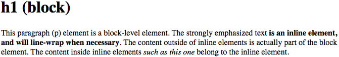
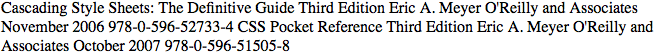

# CSS 和文档

Cascading Style Sheets (CSS) 是一个能够变换文档和文档集合呈现方式的强大工具，它几乎已经扩展到 web 的每个角落，包括许多看起来不是 web 环境的地方。例如，基于 Gecko[1](#f1) 的浏览器通过 CSS 影响 chrome 浏览器自身的呈现，许多 RSS 客户端允许你将 CSS 应用于推送内容，一些即时通讯客户端使用 CSS 来变换聊天窗口。JavaScript 框架（如 jQuery ）甚至 JavaScript 本身所使用的语法中，都有 CSS 的踪迹。它无处不在！

## Web 样式简史

CSS 首次提出于 1994 年，正当网络开始真正流行的时候。当时，浏览器赋予用户各种样式化能力——例如，在Mosaic[2](#f2)的显示偏好中，允许用户基于每个元素定义所有风格的字体系列、尺寸和颜色。而文档开发者却无法做到这些，他们所能做的只是把一段内容标记为段落、作为某级标题、作为预定义格式的文本或者其它很少量的元素类型中的一个。如果用户配置自己的浏览器，把所有一级标题设置成“微小”和粉色，而把六级标题设置为“巨大”和红色，那浏览器就会如用户所设置的显示。

CSS就是在这种背景下引入的，目的是提供一种简单的、声明式的样式语言供文档开发者自由地使用，更重要的是，为开发者和用户提供同样的样式化能力。通过“层叠（ cascade ）”的手段，这些样式可以组合并按优先级排序，让开发者和阅读者都有对样式的控制权——尽管阅读者总是有最终的控制权。

工作迅速推进，到 1996 年年底 CSS1 标准完成了。新成立的 CSS 工作组继续向前推进 CSS2，浏览器们则在尽力以相互兼容的方式实现 CSS1。尽管每个单独的 CSS 片段都相当简单，但它们的组合却产生了令人意外的复杂行为。早期的实现还存在一些不幸的失误，比如今天已经臭名昭著的盒模型实现的差异。这些问题使 CSS 面临被完全摧毁的风险，但幸运的是一些聪明的提案被实现了，浏览器们也开始协调起来了。几年内，得益于持续增加的互通性和高关注度的开发者（如基于 CSS 重新设计的《连线（Wired）》杂志和 CSS 禅意花园（Zen Garden）），CSS 开始流行起来。

在这一切发生之前，CSS 工作组已经在 1998 年初完成了 CSS2 规范。CSS 2一完成，CSS3（以及一个 CSS2 的清晰化版本叫作 CSS2.1）的工作就立即开始了。与时俱进的 CSS3 被构造为一系列（理论上的）独立模块，而不是单个的整体规范。这种做法体现了当时活跃的 XHML 规范的影响，它（XHML）也因为类似的原因被拆分成模块。

把 CSS3 模块化的理由是，每个模块可以按照自己的步调发展，特别重要（或流行）的模块可以随着 W3C 的路线先行推进，而不必被其它模块拖延。事实也正是如此。到 2012 年初，3 个 CSS3 模块（与 CSS1 和 CSS 2.1 一起）达成了**完整推荐状态**[3](#f3)——CSS Color Level 3、CSS Namespaces 和 Selectors Level 3。与此同时，七个模块正处于**候选推荐状态**[4](#f4)，其它几十个模块处在工作草案的不同阶段。按照以前的做法，颜色、选择器和命名空间三个模块将不得不等待规范中的所有其它模块都被完成或取消，才能作为完整规范的一部分被提案。得益于模块化，它们不需要等待规范的其它部分了。

模块化带来了好处，但也使得我们很难说有一个“CSS3 规范”存在。事实上并没有，而且也不会有这样一个规范。即便其它每个 CSS3 模块都达成了 level 3 ——假如，在2016年底（并没有）——可能那时已经有一个 Selectors Level 4 正在推进中了，我们应该把它叫做 CSS4 吗？其它“CSS3”里还在进行中的特性叫作什么呢？更别说还有 Grid Layout 这种连 Level 1 都没有达成的（模块）。

所以，虽然我们不能指着一个大部头说：“这就是 CSS3”，但我们可以对每个模块名称及它们所指代的功能特性进行讨论。模块灵活性上的好处远远大于它们引入的语义上尴尬的坏处。（如果你真的想要一个接近于整个的规范的东西，CSS 工作组每年都会发布年度“快照（Snapshot）”文档。）

进行到这里，我们可以开始理解 CSS 了。首先，从（文档）标记开始。

## 元素

元素是文档结构的基础。在 HTML 中，最常见的那些元素都很容易识别，例如`p`、`table`、`span`、`a`和`div`。每个元素都在文档展示中扮演各自的角色。

### 替换元素和非替换元素

虽然 CSS 依赖于元素，但并不是所有元素都一样。例如，图片和段落就不是同类型的元素，`span`和`div`也不同。在 CSS 中，元素通常有两种形式：替换的和非替换的。

#### 替换元素

**替换元素**是指那些内容会被其它东西所替换的元素，这些东西并不直接出现在文档内容里。HTML 中最为人所熟悉的例子大概就是`img`元素了，它会被存储在文档外部的一个图片文件所替代。事实上，`img`元素没有实在的内容，正如下面的简单示例中所展示的：

    

这个标记片段只包含元素名称和属性。 除非你把它指向外部内容（这里是由`src`属性指定的图片），这个元素不会显示任何内容。 如果把它指向有效的图片文件，则图片将被放置在文档中。反之，它将不显示任何内容，或者，浏览器将在这里放置一个“损坏图像”的占位符。

类似地，`input`元素也会被替换为单选按钮、复选框或文本输入框 —— 这取决与`input`元素的`type`属性。

#### 非替换元素

大多数 HTML 元素是**非替换元素**。这意味着元素的内容会被用户代理（通常是浏览器）显示在一个由元素自己生成的“盒子”里。例如，`hi there`是一个非替换元素，文字“hi there”会由用户代理显示。对于段落、标题、表格单元格、列表以及 HTML 中的其他大部分元素都是如此。

### 元素显示角色

除了替换和非替换元素，CSS 还使用另外两种基本类型来区分元素：**块级（block-level）**和**行内级（inline-level）**。还有很多显示类型，但这两个是最基本的，也是绝大部分（如果不是全部）其他类型会涉及的类型。曾经花费时间在 HTML 标签和它们在web浏览器中显示上的开发者，对块级和行内类型不会陌生。元素在图1中展示。

*图1：HTML文档中的块级和行内元素*

#### 块级元素

**块级元素**生成一个（默认情况下）元素框，填充其父元素的内容区域，并且在其两侧不能有其他元素。 换句话说，它在元素框之前和之后生成“断行”。 HTML 中最常见的块元素是`p`和`div`。 替换元素可以是块级元素，但通常不是。

列表项是一种特别的块级元素。 除了与其他块级元素一致的行为之外，它们还生成一个标记（通常是用于无序列表的项目符号和用于有序列表的数字）并“附加到”元素框。 除了这个标记，列表项与其他块级元素的行为完全相同。

#### 行内元素

**行内元素**在文本行内生成一个元素框，并且不会破坏该行的流。HTML 中最好的例子是`a`元素，其它还有`strong`和`em`。这些元素不会在自身之前或之后生成“断行”，所以它们可以出现在其它元素的内容之中，并且不会破坏其显示。

需要注意，虽然名称“块级”和“行内”与 HTML 中的块和行内元素有很多共同之处，但还有个重要区别：在 HTML 中，块级元素不能作为行内元素的后代；但在 CSS 中，对显示角色之间的嵌套没有限制。

要了解其工作原理，我们来考虑一个CSS属性`display`：

| | DISPLAY |
| ---- | ----- |
|取值| [ <display-outside> ‖ <display-inside> ] | <display-listitem> | <display-internal> | <display-box> | <display-legacy> |
|定义|见下|
|初始值|inline|
|适用元素|所有元素|
|计算值|按规范取值|
|继承|否|
|动画|否|

**`<display-outside>`**
> block | inline | run-in

**`<display-inside>`**
> flow | flow-root | table | flex | grid | ruby

**`<display-listitem>`**
> list-item && \<display-outside\>? && [ flow | flow-root ]?

**`<display-internal>`**
> table-row-group | table-header-group | table-footer-group | table-row | table-cell | table-column-group | table-column | table-caption | ruby-base | ruby-text | ruby-base-container | ruby-text-container

**`<display-box>`**
> contents | none

**`<display-legacy>`**
> inline-block | inline-list-item | inline-table | inline-flex | inline-grid

你可能已经注意到了这里有许多取值，只有其中三个是我提到过的：`block`、`inline`和`list-item`。这些取值的大部分会在本书其他部分介绍；例如`grid`和`inline-grid`涵盖在介绍栅格布局的独立的一章，跟表格相关的值都包含在介绍 CSS 表格布局的章节中。

现在我们把注意力放在`block`和`inline`上，看下面的代码：

~~~html
<body>
	
This is a paragraph with <em>an inline element</em> within > it.
 
</body>
~~~

这里有两个块级元素（`body`和`p`）和一个行内元素（`em`）。根据 HTML 规范，`em`可以作为`p`的后代，但反过来则不行。通常HTML 的层级结构允许行内元素作为块级元素的后代，而不是相反。

CSS则没有这样的限制，你可以保持现有的标签结构，然后修改这两个元素的显示角色：

~~~css
p {display: inline;}
em {display: block;}
~~~

这使得元素在一个行内框里面生成了一个块级框，这在CSS中是完全合法的，不会破坏任何规范。但是，如果你想在 HTML 中使用相反的嵌套结构，那就有会问题了，像这样：

~~~html
<em>
This is a paragraph improperly enclosed by an inline element.
</em>
~~~

不管你如何使用 CSS 来修改它们的显示角色，这在 HTML 中都是不合法的。

修改元素的显示角色在 HTML 文档中很有用，它对 XML 文档也至关重要。XML 文档一般没有默认的显示角色，而完全依赖文档开发者去定义它们。例如，如果你想要展示下面的 XML 片段：

~~~xml
<book>
	<maintitle>Cascading Style Sheets: The Definitive Guide</maintitle>  
	<subtitle>Third Edition</subtitle>  
	<author>Eric A. Meyer</author>  
	<publisher>O'Reilly and Associates</publisher>  
	<pubdate>November 2006</pubdate>  
	<isbn type="print">978-0-596-52733-4</isbn>  
</book>  
<book>  
	<maintitle>CSS Pocket Reference</maintitle>   
	<subtitle>Third Edition</subtitle>  
	<author>Eric A. Meyer</author>  
	<publisher>O'Reilly and Associates</publisher>  
	<pubdate>October 2007</pubdate>  
	<isbn type="print">978-0-596-51505-8</isbn>  
</book>
~~~

因为`display`属性的默认值是`inline`，所以这块内容会默认被显示为行内文本，就像图 2 所示的那样。这样的排版不太有用。

*图2：一个XML文档的默认显示*

你可以用`display`来定义文档的基本板式：

~~~css
book, maintitle, subtitle, author, isbn {display: block;} 
publisher, pubdate {display: inline;}
~~~

这样把 7 种元素中的 5 个设置成块级元素，2 个设置成行内元素。块级元素会被像HTML中的`div`那样处理，两个行内元素会被类似`span`那样处理。

因为这种设置显示角色的基本能力，CSS 在各种场景下都非常有用。你可以从上面的规则开始，添加一些更具视觉效果的样式，然后得到像图 3 这样的显示效果。

*图3：添加了样式的XML文档*

在详细学习如何编写 CSS 之前，我们先要看一下如何关联 CSS 和文档，毕竟，如果不把它们结合在一起，CSS 是无法对文档起作用的。我们从最熟悉的 HTML 设置开始。

## 结合CSS和HTML

我提到过 HTML 文档存在一个固有结构，这一点值得重复一下。实际上有个旧网页开发遗留的问题：我们太多人忘记了文档是应该有一个内在结构的，这与视觉上的结构是完全不同的。我们急于在 Web 上创建看起来最酷的网页，我们改造转换、修饰装点，全然忽视了页面应该包含具有一些结构意义的信息。

这种结构是 HTML 和 CSS 之间关系所固有的组成部分，没有它，关系就不会存在。为了更好地理解这种结构，我们把下面这个示例的HTML文档拆解来看：

~~~html
<html>
  <head>
    <title>Eric's World of Waffles</title>
    <meta http-equiv="content-type" content="text/html; charset=utf-8">
    <link rel="stylesheet" type="text/css" href="sheet1.css" media="all"> 
    
  </head>
  <body>
    <h1>Waffles!</h1>
    
The most wonderful of all breakfast 
    foods is the waffle—a ridged and cratered slab of home-cooked, 
    fluffy goodness that makes every child's heart soar with joy. 
    And they're so easy to make! Just a simple waffle-maker and some 
    batter, and you're ready for a morning of aromatic ecstasy!
    

  </body>
</html>
~~~

代码的处理结果及应用的样式的如图 4 所示。

*图片4：一个简单文档*

现在我们来看文档关联CSS的几种方式。

### `link`标签

首先是`link`标签的使用：

~~~html
<link rel="stylesheet" type="text/css" href="sheet1.css" media="all">
~~~

`link`标签是一个有些被忽视的标签，但它是在 HTML 规范中存在了许多年的合法标签，一直在等着被善加利用。它最初的目的是允许 HTML 开发者把包含链接标签的文档与其他文档关联起来。CSS使用`Link`标签把样式表链接到文档中，如图 5，一个名为`sheet1.css`的样式表被连接到文档。

*图片5：展示外部样式表如何被应用到文档*

这些样式表不是 HTML 文档的一部分但仍被应用于文档中，它们被称为**外部样式表**，因为它们存在于 HTML 文档的外部（看图）。

链接必须放置在`head`元素内，外部样式才能成功加载，与`title`不同，它不能被放置在任何其它元素里。像图 5 所示的那样，web 浏览器会定位并加载样式表，然后把样式表中的任何样式都应用在 HTML 文档渲染中。图 5 中还展示了使用`@import`声明加载的外部样式`sheet2.css`。`@import`必须在包含它的样式表的开头[5](#f5)，除此之外没有限制。

那么外部样式表是什么样的格式呢？和我们在前面章节中和在示例HTML文档中看到的那些样式一样，外部样式也是简单的规则列表，但是这些规则存储在自己的文件里面。要记住，HTML 和其它任何标记语言都不能放进样式表中——它只能包含样式规则。一个外部样式表的内容是这样的：

~~~csss
h1 {color: red;}
h2 {color: maroon; background: white;} 
h3 {color: white; background: black; font: medium Helvetica;}
~~~

这就是它的全部内容——没有 HTML 标记或者注释，只有干净简单的样式声明。它们被存储在纯文本文件中，通常用`.css`作为后缀，例如`sheet1.css`。

_**外部样式中不能包含任何文档标记，只能包含 CSS 规则和 CSS 注释，我们将在后面的章节解释它们。外部样式表中的标记可能会导致其中的全部或部分样式被忽略。**_

文件扩展名不是必需的，但如果文件名不是以`.css`结尾，即使你在`link`元素中设置了正确的文件类型`text/css`，一些旧浏览器依然无法把文件识别为样式表。实际上，如果文件名不是以`.css`结尾，一些web服务器不会把文件当做`text/css`来处理，但通常这个问题可以通过修改服务器配置文件来解决。

#### 属性

对于`link`标签的其它部分，属性和值都很直白。`rel`表示“关系”（relation），这里关系就是`stylesheet`（样式表）。`type`属性始终设置为`text/css`，这个值描述了被`link`标签加载的数据的类型。这样，web 浏览器就可以知道这个样式表是一个 CSS 样式表，这决定着浏览器如何处理它引入的数据。毕竟，将来可能会用到其它样式语言，所以声明你所使用的是哪种语言是有必要的。

接下来是`href`属性，这个属性的值是样式表的 URL。URL 可以是绝对或相对地址，这取决于你的需要。在示例中 URL 是相对的，显然它也可以是`http://meyerweb.com/sheet1.css.`这种形式。

最后是`media`属性，这个属性的值是一个或多个**媒体描述符**。媒体描述符是关于媒体类型和这些媒体的特性的规则，每个规则之间用逗号分隔。例如，你在屏幕和投影媒体上都可以使用一个这样的链接样式表：

~~~html
<link rel="stylesheet" type="text/css" href="visual-sheet.css" media="screen, projection">
~~~

媒体描述符可以设置得非常复杂，我们将会在本章中稍后的部分做详细解释，现在我们只使用基本的媒体类型。

注意，一个文档可以关联多个样式表。这时，只有那些包含`rel`属性值为`stylesheet`
的样式表会被用于文档的初始化显示。因此，如果你想分别链接两个名为`basic.css`和`splash.css`的样式表，看起来会像这样：

~~~html
<link rel="stylesheet" type="text/css" href="basic.css"> 
<link rel="stylesheet" type="text/css" href="splash.css">
~~~

这种写法会使浏览器加载两个样式表，并合并每个样式表的规则，然后把它们全部应用于文档。例如

~~~html
<link rel="stylesheet" type="text/css" href="basic.css"> 
<link rel="stylesheet" type="text/css" href="splash.css">
This paragraph will be gray only if styles from the stylesheet 'basic.css' are applied.

This paragraph will be gray only if styles from the stylesheet 'splash.css' are applied.

~~~

有一个可以但是并没有在示例代码中出现的属性`title`。这个属性并不常用，但它可能会在未来变得重要，如果使用不当会带来意想不到的效果。为什么呢？我们将在下一节中探讨。

#### 备用样式表

可以定义**备用样式表**。它们是通过把`rel`属性的值设为`alternate stylesheet`来实现的，而且它们只有被用户选择的时候才会用于文档显示。

如果浏览器能够使用备用的样式表，它会用`link`元素的`title`属性值来生成一个可选择的样式列表。你可以像下面这样写：

~~~html
<link rel="stylesheet" type="text/css" href="sheet1.css" title="Default">
<link rel="alternate stylesheet" type="text/css" href="bigtext.css" title="Big Text">
<link rel="alternate stylesheet" type="text/css" href="zany.css" title="Crazy colors!">
~~~

然后用户就可以选择他们想用的样式，浏览器将会从第一个（这里被标记为“默认”（Default））切换到用户选择的任意一个。图6展示了这种选择机制的一个可能的（实际上是CSS再次兴起的早期所使用的）完成方式。

*图6：一个支持选择备用样式的浏览器*

_**到2016年底，大部分基于Gecko引擎的浏览器已经支持了备用样式表，如Firefox和Opera。在Internet Explorer系列的浏览器中可以使用JavaScript实现支持，但是没有被浏览器原生支持。Webkit系列浏览器不支持选择备用样式表。（相比之下，图6所示的这么老旧的浏览器都提供了支持，真是令人惊讶。）**_

通过给`title`属性赋相同的值，备用样式表可以分组组合。因此，你可以让用户在无论屏幕媒体还是打印媒体中都能选择不同的展示方式。例如：

~~~html
<link rel="stylesheet" type="text/css" href="sheet1.css" title="Default" media="screen">
<link rel="stylesheet" type="text/css" href="print-sheet1.css" title="Default" media="print">
<link rel="alternate stylesheet" type="text/css" href="bigtext.css" title="Big Text" media="screen">
<link rel="alternate stylesheet" type="text/css" href="print-bigtext.css" title="Big Text" media="print">
~~~

如果用户在支持备用样式表选择机制的用户代理中选择了“Big Text”，那么`bigtext.css`将在屏幕媒体中为文档设置样式，而`print-bigtext.css`将会被用在打印媒体上。`sheet1.css`和`print-sheet1.css`不会被用在任何一个媒体中。

为什么会这样？因为一旦你为一个`rel`属性值为`styleshet`的`link`标签设置了`title`，你就指派了这个样式表为**优先样式表**。这表示它会比备用样式表优先被使用，会被用在文档第一次显示的时候。但是，当你选择了一个备用样式表的时候，优先样式表就**不会**再被使用了。

此外，如果你把多个样式表都指派为优先使用，那么除了一个之外所有其它的样式表都会被忽略。考虑下：

~~~html
<link rel="stylesheet" type="text/css" href="sheet1.css" title="Default Layout">
<link rel="stylesheet" type="text/css" href="sheet2.css" title="Default Text Sizes">
<link rel="stylesheet" type="text/css" href="sheet3.css" title="Default Colors">
~~~

由于都被设置了`title`属性，三个`link`元素都被指定为优先样式表，但只有一个会被真正被作为优先样式表，而另外两个会完全被忽略。哪两个呢？没有办法确定。因为HTML并没有提供一种方式，来决定哪个样式应该被忽略，哪个样式应该被使用。

如果你根本不给样式表设置`title`，它将变成一个**持久的样式表**，并一直用在文档显示中。通常这正是开发者想要的。

### `style`元素

一种包含样式表的方法是使用`style`元素，它像这样显示在文档中：

~~~html

~~~

`style`需要设置`type`属性，与`link`标签一样，使用CSS文档的时候`type`值应该设置为`text/css`。

就像上面的示例所表示的，`style`元素总是以``作结束。`style`也可以指定一个`media`属性，它的作用与前面介绍的在链接样式表中的功能是一样的。

这种在`style`开始和结束标签之间的样式被称为**文档样式表**或者**内嵌样式表**（因为这种样式表是嵌入在文档里的）。内嵌样式表包含许多应用于文档的样式，也可以使用`@import`指令链接至多个外部样式。

### `@import`指令

现在我们开始讨论`style`标签内部。首先是与`link`非常类似的`@import`指令：

~~~css
@import url(sheet2.css);
~~~

像`link`一样，`@import`可以指示浏览器加载一个外部样式然后把它应用到 HTML 文档渲染中。它们之间主要的区别只是在于语法和命令的位置。正如我们看到的这样，`@import`是被包含在`style`中的。命令必须放在其他 CSS 规则之前，否则它不会生效。看这个例子：

~~~html

~~~

与`link`相同的是，一个文档中可以有多个`@import`声明。但与`link`不同的是，`@import`指令中的每个样式表都会被加载和使用，`@import`不能设置备选样式表。因此，如果使用下面的代码：

~~~css
@import url(sheet2.css); 
@import url(blueworld.css); 
@import url(zany.css);
~~~

全部三个外部样式都会被加载，它们的样式规则也都会被用于文档显示中。

类似`link`，你可以在样式表的 URL 后添加媒体描述符，来限制样式表被用于一个或多个媒体：

~~~css
@import url(sheet2.css) all;
@import url(blueworld.css) screen; 
@import url(zany.css) projection, print;
~~~

正如在`link`元素的章节中介绍的，媒体描述符可能会非常复杂，我们将在《第 20 章 媒体选择样式》中详细介绍。

如果你想要在一个外部样式表中使用另一个外部样式表，`@import`非常有用。因为外部样式表不能包含任何文档标记，`link`元素就无法使用，但`@import`却可以。所以，一个外部样式表可能是这样的：

~~~css
@import url(http://example.org/library/layout.css); 
@import url(basic-text.css);
@import url(printer.css) print;
body {color: red;}
h1 {color: blue;}
~~~

这些不是真正使用的样式，但是你可以通过它们看到`@import`的用法。上例中同时使用了绝对和相对 URL，像`link`一样，两种都URL格式都可以使用。

还要注意，正如我们在示例文档中所做的，`@import`指令出现在样式表的开头。CSS 要求`@import`指令出现在样式表的其它规则之前。出现在其它规则（例如：`body {color: red;}`）之后的`@import`会被标准的用户代理所忽略。

_**在Windows系统上的旧版的Internet Explorer浏览器中，即使`@import`指令放在其他规则之后，也不会被忽略。但其他浏览器会忽略位置不正确的`@import`指令，这很容易导致放置不正确的`@import`引起其他浏览器的显示错误。**_

### HTTP链接

把 CSS 关联到文档还有一种非常晦涩的方式：你可以通过 HTTP 标头把它们链接在一起。

在 Apache 环境下，可以在`.htaccess`文件中添加CSS的文件引用来完成关联，例如：

~~~
Header add Link "</ui/testing.css>;rel=stylesheet;type=text/css"
~~~

支持该特性的浏览器会将引用的样式表与任何该`.htaccess`文件配置下的文档相关联，浏览器会把它当做一个链接样式表。另一个可能更有效的选择是，把相同的规则添加到服务器的`httpd.conf`文件中：

~~~xml
<Directory /path/to/ /public/html/directory>
Header add Link "</ui/testing.css>;rel=stylesheet;type=text/css" 
</Directory>
~~~

对支持该特性的浏览器来说，这两种方式效果是一样的，唯一的区别是只是你在哪里声明链接而已。

你肯定注意到了前面所使用的“支持该特性的浏览器”。至2017年底，被广泛使用的浏览器中支持 HTTP 链接样式表的有 Firefox 系列和 Opera。这使得大部分情况下这项技术被限制在使用这些浏览器的开发环境中。在这些环境中，你可以在测试服务器上使用 HTTP 链接来标记测试环境网页，从而与发布的公共版网页区分开来。这项技术还是一种有趣的用来对 WebKit 和 Internet Explorer 系列浏览器隐藏样式的方法——假如你基于某些原因需要这么做的话。

_**等价的技术存在于通用脚本语言中，如 PHP 和 IIS，这两种语言都允许开发者发出 HTTP 头。使用这些语言可以向服务器的文档中写入`link`元素。这种技术有浏览器的更好的支持：每个浏览器都支持`link`元素。**_

### 行内样式

如果你只想简单地为一个单独元素设置一些样式，不需要使用内嵌或者外部样式表，使用 HTML 的`style`属性来设置**行内样式**即可：

~~~html

The most wonderful of all breakfast foods is the waffle—a ridged and cratered slab of home-cooked, fluffy goodness... 

~~~

除了位置在`body`之外的标签（`head`及`title`等），`style`属性可以设置在任何 HTML 标签上。

`style`属性的语法很普通，跟`style`元素里面的规则声明很像，只不过花括号被换为双引号。`
`会把**当前段落**的文本设置为栗色，把背景设置为黄色，文档的其它部分不会受到这些样式声明的影响。

请注意，行内`style`属性只能放置样式规则声明块，而不是整个样式表。因此,`style`属性里既不能放置`@import`，也不能放进任何完整的样式规则，`style`属性的值只能被设置为样式规则花括号里面的那部分。

`style`属性通常不建议使用，实际上它也不大可能出现在 HTML 之外的 XML 语言中。当把样式放置在`style`属性中时，许多 CSS 的主要优势——例如将整个文档或服务器的所有文档的样式集中组织的能力——便无法有效发挥了。从许多方面来说，使用行内样式并不比使用`font`标签好多少，尽管处理视觉效果的时候它确实（比`font`标签）更灵活。

## 样式表内容

那么，样式表的内容到底是什么样呢？像这样：

~~~css
h1 {color: maroon;}
body {background: yellow;}
~~~

各种各样的嵌入样式表都是有这样的内容组成，无论内容长短，简单还是复杂。很少有文档的`style`元素不包含任何规则——尽管有的文档可能只包含一个简单的`@import`声明列表而没有像上面那样的真正的规则。

在开始本书的其它内容之前，我们首先需要确认样式表中能包含哪些东西，以及不能包含哪些东西。

### 标记

**样式表中没有标记。**这似乎是显而易见的，但可能会让你惊讶的是，有一个 HTML 注释标记是例外，因为历史原因它允许存在于`style`元素中：

~~~html

~~~

就这样。

### 规则结构

我们把结构分解，详细地说明规则的概念。

每条规则由两个基本部分构成：**选择器**和**声明块**。声明块由一个或多个**声明**组成，每个声明是一个**属性-值**对。每个样式表都是由一系列规则组成的。图 7展示了规则的组成部分：

*图7：规则的结构*

规则左侧的选择器，定义了文档中的哪些部分这条规则影响。图 7 中选择了`h1`元素，如果选择器是`p`，那所有的`p`（段落）元素将会被选择。

规则右侧是由一或多个声明组成的声明块。每个声明都由一个 CSS 属性和这个属性的取值组成。在图 7 中，声明块包含两个声明。第一个会使受影响的那部分文档的`color`属性值为`red`，第二个会使受影响的那部分文档的`background`属性值为`yellow`。因此，文档中所有的`h1`元素（由选择器决定）都会被设置为红色文字和黄色背景。

#### 厂商前缀

有时你会看到CSS中存在像`-o-border-image`这样在前面带着短线和标签的声明。这被称作**厂商前缀（vendor prefixes）[6](#f10)**，浏览器厂商在提供试验性或专有（或两者）功能时，用它来标记属性、值或其他CSS内容。到 2016 年底已经有了很多厂商前缀，表 1 中列出了最常见的几种。

*表1： 一些常见的厂商前缀*

|前缀|厂商|
|:----|:-----
|-epub-|国际数字出版论坛 epub 格式
|-moz-|基于 Mozilla 的浏览器（如：Firefox）
|-ms-|Microsoft Internet Explorer
|-o-|基于 Opera 的浏览器
|-webkit-|基于 WebKit 的浏览器（如：Safari 和 Chrome）

如表 1 所示，厂商前缀的通常格式是短线-标签-短线，尽管有些（厂商的）前缀错误地省略了第一个短线。

厂商前缀的使用以及其后的滥用是一个漫长而又曲折的过程，讲述它超出了本书的范围。我们只需知道，它们一开始是作为厂商测试新功能的一种方式，从而有助于加速（不同浏览器之间）的互通性，而不至于被其它不能兼容的旧浏览器禁锢脚步。这避免了一系列问题，使得 CSS 幸免于在初期就被扼杀的厄运。然而不幸的是，随后前缀属性被 web 开发者无所顾忌地配置，最终导致了一系列新的问题。

到 2016 年底，厂商前缀正在逐步减少，旧的前缀属性和值正在从浏览器的实现中慢慢移除。也许你再也不需要写前缀 CSS 了，这是完全可能的，但你说不定从哪遭遇到它，或者从遗留代码里遇到它。

### 空格处理

虽然有些例外，但基本上 CSS 对规则间的空格不敏感，对规则内的空格则更加不敏感。

一般来说，CSS 处理空格的方式类似 HTML：任何空格字符的序列都被当做单个空格解析。因此，一个假想的`rainbow`规则可以格式化为下面的格式：

~~~css
rainbow:infrared red orange yellow green blue indigo violet ultraviolet; 
rainbow:
	infrared red orange yellow green blue indigo violet ultraviolet;  
rainbow:
	infrared 
	red
	orange 
	yellow 
	green
	blue 
	indigo 
	violet 
	ultraviolet 
	;
~~~

以及其他你能想到的分隔模式。唯一的限制是分割字符需要是空白：空格、tab 符、换行符，单个还是组合使用，随你喜欢。

类似地，你可以使用空白把一系列样式规则按照任何你偏好的风格格式化，这是无限多种可能中的五种格式：

~~~css
html{color:black;}
body {background: white;} 
p{
	color: gray;} 
h2 {
	color : silver ; 
	}
ol 
	{
		color 
			:
		silver 
			;
}
~~~

在第一条规则中，空白被最大化地略去了。这种情况通常发生在 CSS “压缩”的时候，这时会把不影响语义的空格全部删除。前两条之后的规则逐渐加入更多空白，到最后一条规则，几乎每个可以被分隔的地方都被分开了。

以上的每种方式都是合法的，因此你应该选择一种最有意义的格式，即在你看来最易读的格式，然后坚持一贯地使用它。

有些地方是确切地需要空白的，最常见的例子是在属性值中分隔关键字列表，例如上面的假想 rainbow 例子中。这些地方必须用空白来分隔。

### CSS注释

CSS是允许添加注释的。与 C/C++ 中用`/*`和`*/`包裹的注释类似：

~~~css
/* This is a CSS1 comment */
~~~

象 C++ 中一样，注释可以连续多行：

~~~css
/* This is a CSS1 comment, and 
it can be several lines long without 
any problem whatsoever. */
~~~

要记住，CSS注释不允许嵌套，像这样是不正确的：

~~~css
/* This is a comment, in which we find 
another comment, which is WRONG
/* Another comment */
and back to the first comment */
~~~

_**一个可能会创建了“嵌套”注释的场景是，当想要把样式表中一大块包含了注释的代码临时注释掉时。因为 CSS 不允许嵌套注释，“外层”注释会在“内层”注释结束的时候就结束了。**_

不妙的是，CSS中没有行注释符，如`//`和`#`（这个字符是 ID 选择器的保留字）。`/* */`是唯一的CSS注释方式。因此，如果你想要把注释放置在规则的同一行，就要小心放置的方式，例如，这是正确的方式：

~~~css
h1 {color: gray;} /* This CSS comment is several lines */ 
h2 {color: silver;} /* long, but since it is alongside */ 
p {color: white;} /* actual styles, each line needs to */ 
pre {color: gray;} /* be wrapped in comment markers. */
~~~

这个例子里，如果单行注释没有关闭，会导致大部分样式表变成注释的一部分，也就不能生效了：

~~~css
h1 {color: gray;} /* This CSS comment is several lines 
h2 {color: silver;} long, but since it is not wrapped 
p {color: white;} in comment markers, the last three 
pre {color: gray;} styles are part of the comment. */
~~~

在这个例子中，只有第一行规则（`h1 {color: gray;}`）会被应用于文档。其它的则被浏览器的渲染引擎当做注释的一部分而忽略掉了。

_**CSS注释会被CSS解析器当做不存在一样，也不会当做空白处理，这意味着你可以把注释放进规则中间，甚至放在声明里！[7](#f11)**_

## 媒体查询

通过媒体查询，开发者可以定义不同媒体环境中浏览器可以使用的样式表。过去，这是通过使用`media`属性来为`link`元素或`style`元素设置媒体类型，以及通过`@import`或`@media`声明的媒体描述符来处理的。现在媒体查询使这个概念更进一步，允许开发者通过使用所谓的媒体描述符，基于给定媒体类型的特性来选择样式表。

### 使用

媒体查询可以使用在以下位置：

- `link`元素的`media`属性。
- `style`元素的`media`属性。
- `@import`声明的媒体描述符部分。
- `media`声明的媒体描述符部分。

媒体查询可以是简单的媒体类型，也可以是媒体类型和特性的复杂组合。

### 简单媒体查询

在了解媒体查询的全部可能性之前，我们先看一些简单的媒体块的例子。假如当样式在投影设备例如幻灯片中时，我们想要一些不同的样式。这里有两行简单的 CSS：

~~~css
h1 {color: maroon;} 
@media projection {    body {background: yellow;} 
}
~~~

在这个例子中，`h1`元素会在所有媒中都显示为栗色，但`body`元素仅会在投影媒体上被设置为黄色背景。

可以在一个样式表中加入许多`@media`块，每个拥有自己的媒体描述符（在后面的章节中详细介绍）。如果你愿意，甚至可以把所有规则封装进一个`@media`模块：

~~~css
@media all {
    h1 {color: maroon;}
    body {background: yellow;} 
}
~~~

但是由于这种写法与去掉第一行和最后一行之后的写法没有什么区别，因此这么做没有什么意义。

例子中的`projection`和`all`就是设置媒体查询的地方。查询依赖于一系列描述媒体类型和媒体参数（例如分辨率或者显示高度）的集合，以此决定何时应用 CSS 块。

### 媒体类型

媒体类型最基础的形式是**媒体类型**，它们首次出现于 CSS2。它们是表示不同类型媒体的简单标签。它们是：

- `all`  
> 用于所有演示媒体。

- `print`  
> 用于可视用户打印文档以及显示文档的打印预览。

- `screen`  
> 用于在桌面电脑显示器等屏幕媒体中显示文档。在此类系统上运行的所有 Web 浏览器都是屏幕媒体用户代理。

_**在撰写本文时[8](#f6)，一些浏览器还支持`projection`类型，允许把文档显示成幻灯片；一些移动设备浏览器支持`handheld`类型，但并不十分可靠。**_

可使用逗号分隔的列表指定多个媒体样式。下面的四个例子使用了相同的方式，把样式表（或样式规则代码块）应用于屏幕和投影媒体。

~~~html
<link type="text/css" href="frobozz.css" media="screen, print"> 

~~~

~~~css
@import url(frobozz.css) screen, print;
@media screen, print {...}
~~~

当向这些媒体类型添加特性描述符（例如描述媒体分辨率和色深的值）时，事情将变得更加有趣。

### 媒体描述符

为`link`元素或者`@import`声明设置过媒体类型的开发者，将会对媒体查询（描述符）的位置非常熟悉。下面是在彩色打印机上渲染文档时应用外部样式表的两种基本等效的方法：

~~~html
<link href="print-color.css" type="text/css" media="print and (color)" rel="stylesheet">
~~~

~~~css
@import url(print-color.css) print and (color);
~~~

任何使用媒体类型的地方，都可以使用媒体查询（描述符）。这意味着对上面的例子，可以使用逗号分隔可以列出多个查询：

~~~html
<link href="print-color.css" type="text/css" media="print and (color), screen and (color-depth: 8)" rel="stylesheet">
~~~

~~~css
@import url(print-color.css) print and (color), screen and (color-depth: 8);
~~~

任何情况下，只要任何一个（逗号分隔的）媒体查询的判断结果为“真”，就会使用关联的样式表。因此，在前面的`@import`中，`print-color.css`将会被应用于彩色打印机或彩色投影环境的渲染。如果在黑白打印机上打印，两个查询的结果都是“假”，则`print-color.css`不会被应用于文档，对于任何屏幕媒体都是如此。

每个媒体描述符由一个媒体类型和一或多个媒体特性组成，每个媒体特性描述符都被包括在括号中。如果没有指定媒体类型，它将被默认设置为`all`，因此下面两个示例是完全等价的：

~~~css
@media all and (min-resolution: 96dpi) {...}

@media (min-resolution: 960dpi) {...}
~~~

一般来说，媒体特性描述符的格式类似于CSS中的属性-值对，但有一些区别。最明显的区别是可以指定一些没有值的特性，例如，使用`(color)`来匹配任何基于颜色的媒体，而使用`(color: 16)`来匹配16位色深的颜色媒体。实际上，不含值的描述符是一个对特性是否存在的一个真/假值判断：`(color)`表示判断“是否是颜色媒体？”。

多个特性描述符可以使用逻辑关键字`and`链接，媒体查询里面有两个逻辑关键字：

- **`and`**  
使用这种方式链接两个或多个媒体特性时，只有当每个媒体特性都为真，总的查询结果才为真。例如，`(color) and (orientation: landscape) and (min-device-width: 800px)`表示三个条件必须都被满足：当媒体环境具有颜色、横向显示，而且设备的显示宽度至少为800像素时，样式表才会被使用。

- **`not`**  
对整个查询求反，如果所有的条件都为真，样式表则不会被使用。例如，`not (color) and (orientation: landscape) and (min- device-width: 800px)`表示如果三个条件被满足，则表达式会被否定。因此，当媒体环境具有颜色、横向显示，并且设备显示宽度至少为800像素时，样式表不会被使用；反之在其它任何情况下，样式表都会被使用。

请注意，`not`关键字只能用在媒体查询的开头。`(color) and not (min-device-width: 800px)`这样的用法是不合法的，在这种情况下，查询会被忽略。同样需要注意的是，太旧的浏览器会因为无法理解媒体查询而总是跳过媒体描述符以`not`开头的样式表。

媒体查询中没有`or`关键字，但分隔查询列表的逗号可以起到“或”的作用——`screen, print`表示“如果媒体是屏幕或打印机，则应用样式”。设置`screen and (max-color: 2) or (monochrome)`将会被忽略，应该写成`screen and (max-color: 2), screen and (monochrome)`来代替。

另外还有一个关键字`only`，专门用于向后兼容。是的，你没看错。

- **`only`**  
用于对无法理解媒体查询的旧浏览器隐藏样式表。例如，为了在所有媒体但仅在能够理解媒体查询的浏览器上应用样式表，写做`@import url(new.css) only all`。对于能够理解媒体查询的浏览器，`only`关键字会被忽略，样式表会被使用；对不能理解媒体查询的浏览器，`only`关键字会创建一个显式的媒体类型`only all`，而这是非法的，因此样式表不会应用于这样的浏览器中。要注意，`only`关键字只能用在媒体查询的开头。

### 媒体特性描述符和值类型

我们已经在示例中见过了一些媒体特性描述符，但还不完整，下面是所有可用描述符的列表（至 2017 年底）：

- `width`  
- `min-width`
- `max-width`
- `device-width`
- `min-device-width`
- `max-device-width`
- `height`
- `min-height`
- `max-height`
- `device-height`
- `min-device-height`
- `max-device-height`
- `aspect-ratio`
- `min-aspect-ratio`
- `max-aspect-ratio`
- `device-aspect-ratio`
- `min-device-aspect-ratio`
- `max-device-aspect-ratio`
- `color`
- `min-color`
- `max-color`
- `color-index`
- `min-color-index`
- `max-color-index`
- `monochrome`
- `min-monochrome`
- `max-monochrome`
- `resolution`
- `min-resolution`
- `max-resolution`
- `orientation`
- `scan`
- `grid`

另外还加入了两个新的值类型

- `<ratio>`
- `<resolution>`

我们将在第 20 章对描述符和值进行完整的结束，以及介绍如何使用它们。

## 特性查询

2015 到 2016 年间，CSS 获得了一种能力，通过判断用户代理是否支持特定的属性-值组合来应用样式块，被称作**特性查询**。

结构上它们与媒体查询很相似。比如你只想为支持`color`属性的元素添加颜色（当然是支持的），可以这样：

~~~css
@supports (color: black) {
    body {color: black;}
    h1 {color: purple;}
    h2 {color: navy;}
}
~~~

效果是这样的：“如果你能识别属性-值组合`color: black`并能用它做点什么，就使用这些样式，否则忽略这些样式。”对于不能理解`@supports`的用户代理，整个代码块都会被跳过。

特性查询是实现渐进增强（progressive enhance）的完美方式。例如，为现有的浮动行内块（float-and-inline-block）布局添加一些栅格布局，你可以保留旧的布局方案然后在样式表里添加这样的块：

~~~css
@supports (display: grid ) {
    section#main {display: grid;}
    /* styles to switch off old layout positioning */
    /* grid layout styles */
}
~~~

理解栅格布局的浏览器会识别这个代码块，覆盖旧的页面布局样式，并使用未来那些基于栅格的样式。太旧的不能理解栅格布局的浏览器很可能也无法理解`@supports`，所以它们会跳过整个块，就像它没有出现过一样。

特性查询可以相互嵌套，也当然可以嵌套在媒体查询中，反过来也可以。你可以基于 flex 盒布局写屏幕和打印样式，把媒体快包在`@supports (display: flex)`块中：

~~~css
@supports (display: flex) {
    @media screen {
        /* screen flexbox styles go here */
    }
    @media print {
        /* print flexbox styles go here */
    }
}
~~~

反过来，你也可以在多个响应式媒体查询块中添加`@supports()`块：

~~~css
@media screen and (max-width: 30em){
    @supports (display: flex) {
        /* small-screen flexbox styles go here */
    }
}
@media screen and (min-width: 30em) {
    @supports (display: flex) {
        /* large-screen flexbox styles go here */
    }
}
~~~

如何组织代码块完全取决于你自己。

和媒体查询一样，特性查询也允许使用逻辑操作符。例如当用户代理同事支持栅格布局和 CSS 形状的时候才应用样式：

~~~css
@supports (display: grid) and (shape-outside: circle()) {
    /* grid-and-shape styles go here */
}
~~~

等同于下面的写法：

~~~css
@supports (display: grid) {
    @supports (shape-outside: circle()) {
        /* grid-and-shape styles go here */
    }
}
~~~

然而，可用的操作符并不仅有`and`。CSS Shapes (在第 10 章详细介绍)是说明`or`用处的好例子，因为很长一段时间内 WebKit 只能通过厂商前缀属性支持 CSS 形状。所以当想要使用形状的时候，可以这样使用特性查询：

~~~css
@supports (shape-outside: circle()) or (-webkit-shape-outside: circle()) {
    /* shape styles go here */
}
~~~

尽管你还是必须使用形状属性的前缀和非前缀两个版本，但这样可以让你向后兼容的 WebKit 的发行版本，同时支持那些支持形状但不需要前缀属性的浏览器。

某些情况下，你想使用与正在（特性查询中）测试的属性不同的属性，会非常方便。回到栅格布局的例子，如果你要在使用栅格布局的时候修改元素的外边距，这是简单的实现版本：

~~~css
div#main {overflow: hidden;}
div.column {float: left; margin-right: 1em;}
div.column:last-child {margin-right: 0;}

@supports (display: grid) {
    div#main {display: grid; grid-gap: 1em 0; overflow: visible;}
    div#main div.column {margin: 0;}
}
~~~

反过来也可以，当不支持栅格布局时添加样式：

~~~css
@supports not (display: grid) {
    /* grid-not-supported styles go here */
}
~~~

在单个查询中可以联合使用逻辑操作符，但应该用圆括号保持逻辑清晰。例如在这种情况下使用样式：支持颜色，同时支持栅格和 flex 布局中的一个：

~~~css
@supports (color: black) and ((display: flex) or (display: grid)) {
    /* styles go here */
}
~~~

注意`or`操作符有一组额外的圆括号，把栅格和 flex 布局包起来，这组圆括号是必需的。如果没有这组括号的话，整个表达式可能匹配失败，导致整个样式被跳过。换句话说，不要这样写：

~~~css
@supports (color: black) and (display: flex) or (display: grid) {
~~~

最后，你可能想知道为什么在特性查询中需要同时传入属性和值，毕竟当使用形状的时候只需要测试`shape-outside`就行了，不是吗？这是因为：浏览器可以轻易支持一个属性但不并支持这个属性的任何一个值。栅格布局是一个好例子，假如你可以这样测试对栅格的支持：

~~~css
@supports (display) {
    /* grid styles go here */
}
~~~

额，就算是 IE4 都支持 `display` 属性。所有理解`@supports`的浏览器肯定也理解`display`属性和它的很多值——但未必支持`grid`。这就是特性查询总是同时测试属性和值的原因。

_**请记住这是*特性*查询，不是正确性查询。某个浏览器能够理解你测试的属性，但对这个属性的实现可能有 bug。所以特性查询并不能给你一个浏览器*正确地*支持某些东西的精确保障。查询结果匹配只是表示浏览器理解你告诉它的东西，并试图去支持它。**_

## 总结

CSS 可以完全改变用户代理显示元素的方式。这种改变可以使用`display`属性在基本的显示级别上执行，并且通过把样式表关联到文档的不同方式来执行，用户不会知道这是通过外部还是内嵌样式表，甚至行内样式表完成的。外部样式表的重要性在于允许开发者把一个站点的所有展示信息放在一个地方，然后把所有文档指向这个地方。这不仅使站点更新和维护变得容易，还因为在文档中移除了所有展示信息而节省了带宽。使用`@supports()`，可以仅使用原生 CSS 实现一些基本的渐进增强策略。

为了充分利用CSS的能力，开发者需要弄清楚如何将一组样式与文档中的元素相关联。为了完全理解CSS是如何做到这一点的，开发者需要透彻地领会 CSS 选择文档片段的方式，这就是下一章的主题。

* * *

<b id="f1">1.</b> 译注：Firefox等浏览器所使用的引擎。[↩](#a1)

<b id="f2">2.</b> 译注：Web发展早期第一个普及的浏览器。[↩](#a2)

<b id="f3">3.</b> 译注：Recommendation 是W3C的推荐标准，标准已经历了理论上和实际上的评审和测试，由W3C作签署，可以广泛应用。这是W3C提案的最终成熟的阶段。）[↩](#a3)

<b id="f4">4.</b> 译注：Candidate Recommendation是W3C的候选推荐标准，候选推荐标准与工作草案相比更加稳定，提案的重大的特性大部分已经锁定。[↩](#a4)

<b id="f5">5.</b> 译注：`@import`规则必须放在其他除了@charset规则以外的CSS规则的前面[↩](#a5)

<b id="f6">6.</b> 译注：本章最初写于2012年，与全书一起出版于2017年[↩](#a6)

<b id="f10">7.</b> 译注：vendor prefixes有时被翻译为“浏览器引擎前缀”或“第三方前缀”，译法未见统一，这里采用直译“厂商前缀”，以突出“vendor”的“厂商”之意。[↩](#a10)

<b id="f11">8.</b> 译注：例如`h1 { co/* comments */lor: red; }`。[↩](#a11)
