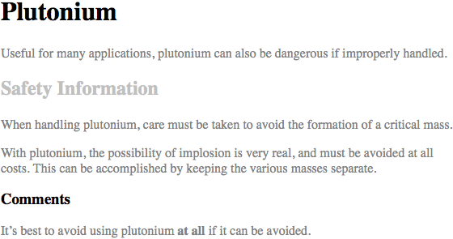
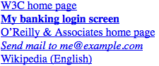
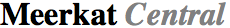
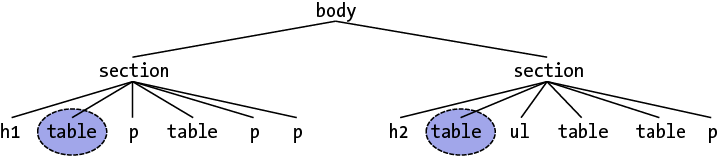
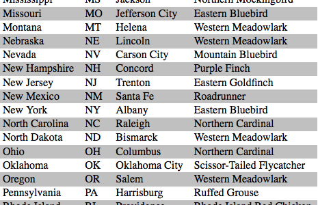

# 选择器

CSS 的一个主要优势——尤其对设计者而言——是它能够轻松地把一组样式应用到同一类型的所有元素。印象不够深刻？想象这样的场景：通过编辑单行 CSS，你可以修改所有标题的颜色。不喜欢正在使用的蓝色？修改一行代码，把它们都变成紫色、黄色、栗色等等任何想要的颜色。这可以让你，设计师，专注于设计而不是繁琐的工作。下次会议中，有人想看绿色标题，你只需要编辑样式然而点击重新加载。瞧!几秒钟就完成了，每个人都可以看到。

当然，CSS 不能解决所有问题——比如，它不能用来改变 PNG 图片的颜色空间，至少现在还不能——但它确实让全局修改变得容易多了。我们先从选择器和结构开始。

## 基本样式规则

如上所述，CSS 的核心特性是将某些样式应用于文档中的整个元素类型的能力。例如，如果你想把所有`h2`元素的文本显示为灰色，使用老套的 HTML，你必须在所有的`h2`元素中插入`...`标签；使用`style`属性也不好，这需要你在所有的`h2`元素上添加`style="color: gray;"`:

~~~html
<h2>This is h2 text</h2>
<h2 style="color: gray;">This is h2 text</h2>
~~~

显然，如果你的文档里面有许多`h2`元素，修改过程将是乏味的。更糟糕的是，如果你之后又想把所有的`h2`从灰色变成绿色，你又得重新开始手动设置一遍便签。（没错，以前就是这么干的！）

CSS 让你可以创建易于编辑的规则，并把它们应用于所有你定义的文本元素（下一部分将解释规则如何生效）。例如，简单地写一次下面的规则，把所有的`h2`元素都变成灰色：

~~~css
h2 {color: gray;}
~~~

如果你想把所有`h2`的文本变成另一种颜色——比如银色——只要简单地选择（属性）值：

~~~css
h2 {color: silver;}
~~~

### 元素选择器

元素选择器通常都是 HTML 元素，但也有例外。例如，如果 CSS 文件的样式是用于 XML 文档的，元素选择器可能会是这样：

~~~css
quote {color: gray;}
bib {color: red;}
booktitle {color: purple;}
myElement {color: red;}
~~~

换句话说，文档的元素被用作最基本的选择器。在 XML 中，选择器可以是任何东西，因为 XML 允许创建新的标记语言，任何东西都可以作为元素名称。另一方面，如果为 HTML 文档添加样式，选择器一般是许多 HTML 元素之一，如`p`，`h3`，`em`，`a`,甚至`html`元素本身。例如：

~~~css
html {color: black;}  
h1 {color: gray;}  
h2 {color: silver;}
~~~

样式表的结果在图1-1中展示：

*图1-1：简单文档的简单样式*

当你直接全局地给元素设置了样式，你可以把样式从一个样式移到另一个样式上。如果你想要图 1-1 中的段落文本而不是`h1`元素是灰色，没问题，只要把`h1`选择器换成`p`就行了;

~~~css
html {color: black;}  
p {color: gray;}  
h2 {color: silver;}
~~~

结果在图1-2中展示:

*图1-2：把样式从一个元素移到另一个上*

### 声明和关键字

声明块包含一或多条声明。一条声明的格式总是一个**属性**后面跟着一个冒号，然后一个**值**后面跟着一个分号。冒号和分号后面可以有零或多个空白。几乎所有的值都是单个关键字或者空白分隔的当前属性允许的多个关键字列表。如果在一条声明中使用了错误的属性或值，整条规则都会被忽略。因此，下面这两条声明是无效的：

~~~css
brain-size: 2cm; /* unknown property 'brain-size' */  
color: ultraviolet; /* unknown value 'ultraviolet' */
~~~

属性值可以使用多个关键字的时候，关键字通常用空白分隔，有些情况下需要斜线（`/`）。很多属性可以接收多个关键字（如`font`属性），但不是全部属性都可以。如果想为段落字体设置中等大小的 Helvetica 字体，就像在图 1-3 中显示的：

*图1-3：属性值包含多个关键字的结果*

规则将是这样：

~~~css
p {font: medium Helvetica;}
~~~

注意两个关键字`medium`和`Helvetica`之间的空白（第一个是字体大小，第二个是字体名称）。空白使用户代理可以分辨出两个关键字并正确地使用它们。分号指明当前声明已经结束。

这些空白分隔的词被称为**关键字**，因为它们在一起组成了属性的值。例如下面这个虚拟的规则：

~~~css
rainbow: red orange yellow green blue indigo violet;
~~~

当然不存在`rainbow`这个属性，它只是被当做例子来进行说明。`rainbow`的值是`red orange yellow green blue indigo violet`，这 7 个关键字放在一起组成了一个唯一的值。我们可以像下面这样重新定义`rainbow`的值：

~~~css
rainbow: infrared red orange yellow green blue indigo violet ultraviolet;
~~~

现在我们有了一个由 9 个而不是 7 个关键字组成的新值。虽然这两个值看起来很像，但他们就像 0 和 1 一样是不同而且唯一的。这里好像有点抽象，但它对理解一些特性和层叠（在本书后面部分讨论）的微妙影响是至关重要的。

如我们所见。CSS 关键字通常使用空白分隔。在 CSS2.1 中有个例外：`font`属性值可以使用正斜杠（`/`）分隔两个特殊的关键字，例如：

~~~css
h2 {font: large/150% sans-serif;}
~~~

斜线分隔的关键字设置元素的字体大小和行高，这是`font`声明中唯一允许使用斜线的地方，`font`的所有其他关键字都使用空白分隔。

斜线已经可以使用在其他一些属性值中，包括可能不限于下面的属性：

- `background`
- `border-image`
- `border-radius`
- `grid`
- `grid-area`
- `grid-column`
- `grid-row`
- `grid-template`
- `mask-border`

还有些关键字使用逗号分隔。声明多个值时，例如多背景图片、变换属性和阴影，声明使用逗号分隔。另外函数参数，如`linear gradiennts`和`transform`等，也使用逗号分隔，示例：

~~~css
.box {box-shadow: inset -1px -1px white,
                  3px 3px 3px rgba(0,0,0,0.2);
      background-image: url(myimage.png),
          linear-gradient(180deg, #FFF 0%, #000 100%);
      transform: translate(100px, 200px);
}
a:hover {transition: color, background-color 200ms ease-in 50ms;}
~~~

这些是基础的简单声明，但它们也可以变得非常复杂。下一部分我们将要展示CSS有多么强大。

## 分组

如我们所见，把一个简单样式应用在一个简单选择器上是非常简单的，但是如果你想把相同的样式引用在多个元素上应该怎么做呢？这种场景下，你会想要把多个选择器或多个样式应用在一个或一组元素上。

### 分组选择器

如果你想让`h2`元素和段落都显示灰色文本，最简单的方式是使用下面的声明：

~~~css
h2, p {color: gray;}
~~~

把`h2`和`p`选择器放置在规则左边并用逗号分隔，这种方式定义了一条把右边样式（`color: gray;`）应用于两个选择器的规则。逗号告诉浏览器规则里面是两个不同的选择器，如果去掉逗号，会使语句变成另外一条含义完全不同的规则。（参见后面的章节“后代选择器”。）

分组的选择器数目没有限制，例如，如果你想把一大堆元素都设置成灰色，你可以用这样的规则：

~~~css
body, table, th, td, h1, h2, h3, h4, p, pre, strong, em, b, i {color: gray;}
~~~

分组允许开发者可以大幅压缩样式分配，从而使样式表更精简。下面两种写法的结果是一样的，哪一种更容易输入是很明显的：

~~~css
h1 {color: purple;}  
h2 {color: purple;}  
h3 {color: purple;}  
h4 {color: purple;}  
h5 {color: purple;}  
h6 {color: purple;}  

h1, h2, h3, h4, h5, h6 {color: purple;}
~~~

分组允许做出一些有趣的选择，例如下面例子中的写法都是等效的，每个例子展示了一种分组选择器和声明的不同方式：

~~~css
/* group 1 */
h1 {color: silver; background: white;}  
h2 {color: silver; background: gray;}  
h3 {color: white; background: gray;}  
h4 {color: silver; background: white;}  
b {color: gray; background: white;}  

/* group 2 */
h1, h2, h4 {color: silver;} 
h2, h3 {background: gray;} 
h1, h4, b {background: white;} 
h3 {color: white;}
b {color: gray;}

/* group 3 */
h1, h4 {color: silver; background: white;} 
h2 {color: silver;}
h3 {color: white;}
h2, h3 {background: gray;}
b {color: gray; background: white;}
~~~

每个例子都会生成图 1-4 显示的结果。（这些样式使用的分组声明，将在接下来的“分组声明”中探讨。）

*图4：等效样式表的结果*

#### 通配选择器

CSS2 引入了一个新的简单选择器叫做**通配选择器**，使用星号（`*`）标注。这个选择器就像一张百搭牌，可以匹配所有元素。例如，要把文档中的每个元素（文本）都设置成红色，可以这样写：

~~~css
* {color: red;}
~~~

此声明等效于一个列出文档中所有元素的分组选择器。通配选择器允许你以一种有效的方式为文档中每个元素的`color`属性设置一个值`red`。但是，要注意，虽然通配选择器很方便，它的特度是 0-0-0，但因为会匹配所有元素，它可能带来意外的后果，我们将在本书后面的部分讨论。

### 分组声明

规则中分组选择器，也可以分组声明。假如你想把所有的`h1`元素设置为紫色、18 像素高的 Helvetica 字体显示在水色背景上（你不介意闪瞎用户），你可以把样式写成这样：

~~~css
h1 {font: 18px Helvetica;}  
h1 {color: purple;}  
h1 {background: aqua;}
~~~

但这种方式是低效的——想象一下为每个元素创建一个10或15个样式的列表！你可以把声明组合在一起来替代前面的写法：

~~~css
h1 {font: 18px Helvetica; color: purple; background: aqua;}
~~~

这种写法和上面的三行样式表是一样的结果。

要注意分组来写的时候每条声明后面的分号至关重要。浏览器会忽略样式表中的空白，因此用户代理要依赖正确的语法来解析样式表。你可以这样格式化样式表：

~~~css
h1 {
	font: 18px Helvetica;  
	color: purple;  
	background: aqua;
}
~~~

也可以通过移除不必要的空白压缩 CSS：

~~~css
h1{font:18px Helvetica;color:purple;background:aqua;}
~~~

上例的后三种写法对服务器来说是等效的，但第二种更易于人类阅读，也是 CSS 开发环境中的推荐写法。（也许压缩 CSS 是出于提高网络性能的原因，但通常这应该由服务器端脚本、网络缓存以及其他服务等来完成。）

如果第二个例子中漏掉了第二个分号，用户代理会把样式表理解成下面这样：

~~~css
h1 {
	font: 18px Helvetica;  
	color: purple background: aqua; 
}
~~~

因为`background:`并不是`color`属性的合法值，而且`color`属性只能有一个关键字，因此用户代理会完全忽略`color`声明（包括`background: aqua`的部分）。你可能认为浏览器至少会把`h1`设置成紫色字体但没有水色背景，但是如果浏览器本身的实现是正确的话，你会连紫色的`h1`也看不到，它们会被设置成默认颜色（通常是黑色）和透明背景（默认）。声明`font: 18px Helvetica`将会依然生效，因为它是以一个分号正确结束的。

_**虽然从技术上来讲，最后一条声明后面的分号并不是必需的，但通常为它加上分号是一个好的实践。首先，丢失分号是渲染错误的最常见的原因之一，遵循这个实践可以使你保持使用分号结束声明的良好习惯；其次，当你为样式规则追加一条声明的时候，不必担心前面的声明后面是否忘了插入分号；第三，如果你曾使用过像 Sass 这样的预处理器，通常尾部的分号对所有声明都是必需的。在每条声明后都跟随一个分号来避免上面的问题。**_

分组声明和分组选择器一起使用，可以方便地保持样式表简洁、富有表现力和易于维护。

### 分组一切

选择器和声明都可以分组，在单条样式中使用这两种分组，可以使用很少的声明式定义非常复杂的样式。如果你要把一些复杂样式应用在文档的所有标题上，而且为他们应用相同的样式，应该怎么做呢？下面是做法：

~~~css
h1, h2, h3, h4, h5, h6 {color: gray; background: white; padding: 0.5em; 
	border: 1px solid black; font-family: Charcoal, sans-serif;}
~~~

因为分组了选择器，右侧的规则会应用在列出的所有标题上；分组声明表明所有列出的样式都会被应用在左侧的选择器上。规则显示的结果如图 1-5。

*图1-5：分组选择器和规则*

这种方案比下面的方案更好：

~~~css
h1 {color: gray;}  
h2 {color: gray;}  
h3 {color: gray;}  
h4 {color: gray;}  
h5 {color: gray;}  
h6 {color: gray;}  
h1 {background: white;}  
h2 {background: white;}  
h3 {background: white;}  
...
~~~

等等还有许多行。你也**可以**像这样写出长长的样式，但我建议你不要这样做——编辑它们就像到处使用`style`属性一样无聊。

可以在选择器中加入更多的表达式，并以跨元素的方式应用样式。当然，要得到这么强大的东西需要付出一些工作，但这是值得的。

### 旧浏览器中的新元素

作为 HTML 的升级，HTML5 规范引入了新的元素。比新元素更早的浏览器不能识别它们。例如，IE9 以前的浏览器无法选择它们不支持的元素。解决办法是在 DOM 中创建元素，以此告知浏览器元素的存在。

例如，IE8 不能识别`<main>`元素，下面这行 JavaScript 代码告诉 IE8 `main`元素的存在：

~~~javascript
document.createElement('main');
~~~

执行这行代码，旧版本的 IE 浏览器可以识别到这些元素，并允许选择它们以及为它们添加样式。

## 类和ID选择器

我们已经以各种方式组合使用了选择器和声明，但我们使用的选择器都非常简单。这些选择器只能用文档元素本身来选择，它们很好用，但有时你需要更专门的选择器。

除了原始的文档元素，还有**类选择器**和 **ID 选择器**，它们允许以独立于文档元素的方式分配样式。这些选择器可以单独使用，也可以与元素选择器结合使用。但是，它们只有在文档被正确标记的时候才能生效，因此使用它们通常需要做一些预想和规划。

例如，假设你正在起草一份讨论处理钚的方法的文件。 该文件包含关于安全处理这种危险物质的各种警告。 您希望每个警告都以粗体文本显示以便更突出，但你不知道这些警告将是哪些元素。 一些警告可能是整个段落，而其他警告可能是冗长列表中的单个项目或一小段文本。 因此，你不能使用任何种类的元素选择器定义规则。 假设你尝试这样写：

~~~css
p {font-weight: bold;}
~~~

**所有的**段落都会被加粗，而不仅仅是包含警告的那些。你需要一种方法来选择仅包含警告的文本，或者更准确地说，只选择那些警告元素。怎么做呢？使用类选择器，把样式应用于文档中那些被用特定方式标记出来的部分，而无论是什么元素。

### 类选择器

忽略元素类型应用样式的最常用方式，是使用类选择器。但是在使用它们之前需要设置文档标记，以便选择器能够生效。添加`class`属性：

~~~html

When handling plutonium, care must be taken to avoid  
the formation of a critical mass.
  
With plutonium, the possibility of implosion is  
very real, and must be avoided at all costs. This can be accomplished  
by keeping the various masses separate.

~~~

要把类选择器和一个元素联系起来，必须为`class`属性设置一个合适的值。在上面的代码中，一个值为`warning`的类被分配给两个元素：第一个段落和第二个段落里的`span`元素。

现在只需要一种方式把样式应用在这些元素上。在HTML文档中，可同`class`名称紧跟一个句点（.），并且可以与元素选择器一起使用：

~~~css
.warning {font-weight: bold;}
~~~

与前面所示的示例标记集合使用，这个简单规则的效果如图 1-6 所示。亦即，声明`font-weight: bold`会应用在每个（得益于隐含的通配选择器）`class`属性值为`warning`的元素上。

_**通配选择器的符号是`*`，使用 ID、类、属性选择器、伪类选择器以及伪元素选择器等时，如果没有结合元素选择器，它们会隐式地包含通配选择器。**_

*图1-6：使用类选择器*

如你所见，类选择器直接通过元素`class`属性中的值来引用元素。引用始终以句点（.）开头，标记它是一个**类选择器**。句点把类选择器和与其组合在一起的其他部分区分开来（例如元素选择器）。假如当只有整个段落是警告时，才设置为粗体：

~~~css
p.warning {font-weight: bold;}
~~~

选择器现在只会匹配任何`class`属性值中包含单词`warning`的`p`元素，而其他类型的元素无论有没有设置`class`值都不会被选中。因为`span`元素不是段落，选择器不会匹配到它，因此它不会显示为粗体文字。

如果想为`span`元素分配不同的样式，可以使用选择符`span.warning`：

~~~css
p.warning {font-weight: bold;}  
span.warning {font-style: italic;}
~~~

这样，警告段落被设置为粗体，而警告`span`被设置为斜体。每个规则仅应用于特定的元素/类组合，而不会影响到其他元素。

另一种做法是使用一个一般的类选择器和一个特定元素的类选择器，来让样式更加有用，例如这样：

~~~css
.warning {font-style: italic;}  
span.warning {font-weight: bold;}
~~~

效果在图1-7中。

*图1-7：使用一般和特定选择器联合样式*

这样设置，任何警告文字都被设置成斜体，但只有`class`属性值为`warning`的`span`元素中，文本既是粗体又是斜体。

请注意上例中的一般类选择器，它只包含一个类名和前面的句点，而没有任何元素名称，也没有通配选择器。如果你想选择具有某个类名的所有元素，省略通配选择器不会有任何影响。

### 多类

我们在前面看到了包含单个单词的`class`的属性值。在HTML中，使用空白分隔的单词列表可以作为单个`class`的值。例如，如果你想把某个特定元素标记为既是紧急的又是一个警告，可以这样写：

~~~html

When handling plutonium, care must be taken to 
avoid the formation of a critical mass.

With plutonium, the possibility of implosion is 
very real, and must be avoided at all costs. This can be accomplished
 by keeping the various masses separate.

~~~

（`class`值中）单词的顺序没有影响，写成`warning urgent`会产生完全相同的结果。

假如你想让所有`class`值为`warning`的元素加粗，把`class`值为`urgent`的设为斜体，而同时包含两个值的元素设置银色背景，写法是这样：

~~~css
.warning {font-weight: bold;}  
.urgent {font-style: italic;}  
.warning.urgent {background: silver;}
~~~

连接两个类选择器，可以选择那些只有同时具有两个类名的元素，无论类名的顺序如何。正如示例，HTML 代码中含有`class="urgent warning"`,但 CSS 选择器却写作`.warning.urgent`。这条规则依然可以把“When handling plutonium . . .”这段设置为银色背景，如图 1-8 所示，这是因为单词书写的顺序并不重要。（但这并不表示类名的顺序总是无关紧要的，我们将会在本书稍后涉及。）

*图1-8：使用多类名选择元素*

如果多类选择器里面包含一个不存在于空格分隔列表的类名，匹配将会失败。例如这个规则：

~~~css
p.warning.help {background: red;}
~~~

你可能期望这个选择器会匹配所有`class`中含有单词`warning`或`help`的`p`元素，然而实际上它不会匹配`class`属性中只有`warning`和`urgent`的`p`元素。它会匹配这样的元素：

~~~html

Help me!

~~~

_**IE7以前的Internet Exlorer版本处理多类选择器有问题。在这些旧版本中，虽然可以选择列表中的单个类名，但对多个类名的选择无法正常生效。`p.warning`会按照预期生效，但` p.warning.help`会匹配任意一个`class`属性值列表中含有`help`的`p`元素。如果你使用`p.warning.help`，旧版本的IE会匹配任何一个`class`值列表中含有`warning`的`p`元素，而无论值中有没有`help`。**_

### ID选择器

从某些方面说，ID 选择器和类选择器类似，但它们有一些重要区别。首先，ID 选择器使用井号（`#`）开头，一条规则可能是这样的：

~~~css
*#first-para {font-weight: bold;}
~~~

这条规则为任意`id`属性值为`first-para`的元素设置文本粗体。

第二个区别是 ID 选择器（理所当然地）查找`id`属性而不是`class`属性的值。这是一个 ID 选择器生效的例子：

~~~css
*#lead-para {font-weight: bold;}
~~~

~~~html
This paragraph will be boldfaced.
  

This paragraph will NOT be bold.

~~~

注意值`lead-para`可以关联给文档中的任意元素。在这个例子中，它只赋给了第一个段落，但是你可以同样赋给第二个、第三个段落。

和类选择器一样，ID 选择器中的通配选择符可以忽略。上例也可以写成这样：

~~~css
#lead-para {font-weight: bold;}
~~~

效果是一样的。

另一个与类选择器相似的地方是，ID 选择器也可以独立于元素类型。可能有些场景下你知道有一个确定 ID 值会出现在文档中，但不知道会出现在哪个元素上（如在前面的钚处理警告中），因此需要声明独立的ID选择器。例如，在任意给定的文档中，有一个元素的 ID 值是`mostImportant`，但不知道这个元素是一个段落、引用、列表还是段落头，只知道这个值会出现在每个文档中的某个随机的元素上，而且在每个文档中仅出现一次。在这种情况下，规则可以这样写：

~~~css
#mostImportant {color: red; background: yellow;}
~~~

这条规则会匹配下面的每一个元素（正如上面强调的，因为它们有相同的 ID 值，所以任意两个*不应该*同时出现在一个文档中）：

~~~html
<h1 id="mostImportant">This is important!</h1>  
<em id="mostImportant">This is important!</em>  
<ul id="mostImportant">This is important!</ul>
~~~

### 决定使用Class还是ID

类可以分配给任意多的元素，类名`warning`可以分配给一个`p`元素或者一个`span`元素，或者更多其他元素。另一方面，ID在一个 HTML 文档中使用且仅使用一次。因此如果有了一个`id`值为`lead-para`的元素，该文档中的其他元素都不能有`lead-para`的`id`值。

_**在实际中，浏览器并不总会检查 HTML 中 ID 的唯一性。如果你为多个元素设置了相同的 ID 属性值，它们可能都会被设置为相同的样式。这是不正确的实现，但这种情况很普遍。在一个文档中存在多个 ID 值相同的元素还会导致 DOM 脚本的问题，因为像`getElementById()`这样的函数依赖于文档中只存在一个 ID 为特定值的元素。**_

与类选择器不同，ID 选择器不能联合使用，因为 ID 属性不允许使用空白分隔的单词列表。

`class`和`id`名称的另一个区别是，当决定某个元素应该应用哪个样式时，ID 有更高的权重。这点将在后面详细讨论。

还要注意类和 ID 可能是大小写敏感的，这取决于文档的语言。HTML 语言把类和 ID 定义为大小写敏感的，因此类和 ID 选择器的大小写要和文档中的匹配。在下面的 CSS 和 HTML 中，元素文字不会被设置为粗体：

~~~css
p.criticalInfo {font-weight: bold;}
~~~

~~~html
Don't look down.

~~~

因为字母`i`的大小写不一致，选择器不会匹配元素。

从纯语法层次来说，点-类标记（例如：`.warning`）不能保证在 XML 文档中生效。在撰写本文时，点-类标记在 HTML、SVG和 MathML 中有效，它可能在未来被更多语言支持，但这要取决于语言本身的规范。哈希-ID  标记（例如：#lead）在所有强制属性唯一性的语言中都有效。唯一性可以强制使用名为`id`的属性，或者任何其他属性，只要在文档中属性内容被定义为唯一的即可。

## 属性选择器

当你使用类和 ID 选择器时，实际上是在选择属性的值。类选择器和 ID 选择器专用于 HTML、XHTML、SVG和 MathML 文档（到撰写本文时），但在其它的标记语言中，这两个选择器可能是不可用的（属性可能不存在）。因此，CSS2 引入了**属性选择器**，使用元素的任意属性和值来选择元素。属性选择器有四种基本类型：简单属性选择器、准确属性值选择器、部分匹配属性选择器和头值属性选择器。

### 简单属性选择器

如果想选择具有某个特定属性的元素，而无论属性的值是什么，可以使用**简单属性选择器**。例如，选择所有具备`class`属性的`h1`元素，然后将其文本设置为银色：

~~~css
h1[class] {color: silver;}
~~~

对如下代码：

~~~html
<h1 class="hoopla">Hello</h1>  
<h1>Serenity</h1>  
<h1 class="fancy">Fooling</h1>
~~~

将得到如图1-9的结果：

*图1-9：使用属性选择元素*

这种策略对 XML 文档非常有用，因为 XML 语言的元素经常含有表示特定意义的属性名。例如可以想象一种描述太阳系行星的 XML 语言（可以叫它 PlanetML）。如果想要选择所有包含`moons`属性的`pml-planet`元素，把文本设置成粗体，用来突出有月亮的行星，可以这样写：

~~~css
pml-planet[moons] {font-weight: bold;}
~~~

第二个和第三个元素将会被设置成粗体，第一个则不会：

~~~html
<pml-planet>Venus</pml-planet>
<pml-planet moons="1">Earth</pml-planet>
<pml-planet moons="2">Mars</pml-planet>
~~~

在HTML中可以用一些创新的方式使用这个特性。例如可以为所有包含`alt`属性的图片设置样式，因此突出形式规范的图片：

~~~css
img[alt] {border: 3px solid red;}
~~~

（这个特殊例子更适用于检查而不是设计目的，用来查看图片是否被设置了完全规范的标记。）

大部分浏览器在鼠标放到元素上的时候，会显示元素的`title`属性值，称为“tool tip”。如果想把所有包含`title`信息的元素粗体显示，可以这样：

~~~css
*[title] {font-weight: bold;}
~~~

相似地，可以选择那些包含`href`属性的锚点（`a`）元素，以此为超链接而不是所有锚点元素添加样式。

也可以基于多个属性选择元素，只需简单地并列多个属性选择器即可。例如，把包含`href`和`title`属性的HTML超链接设置为粗体：

~~~css
a[href][title] {font-weight: bold;}
~~~

第一个链接会设置为粗体，第二个和第三个不会：

~~~html
<a href="http://www.w3.org/" title="W3C Home">W3C</a>   
<a href="http://www.webstandards.org">Standards Info</a>   
<a name="dead" title="Not a link">dead.letter</a>
~~~

### 基于准确属性值选择

可以进一步缩小选择器范围选择那些某个属性为某个确定值的元素。例如，把指向服务器上某个特定文档的链接设置为粗体：

~~~css
a[href="http://www.css-discuss.org/about.html"] {font-weight: bold;}
~~~

所有`href`属性值**准确地**是`http://www.css-discuss.org/about.html`的`a`元素会被设置为粗体。任何修改，即使去掉了`www.`，也会造成无法匹配。

任何属性和值的联合都可以定义在任何元素上，然而，如果这个联合没有（准确地）出现在文档中，选择器不会匹配任何东西。XML      语言再次得益于这种方式来设置属性。回到 PlantML 的例子，如果想选择那些`moons`属性值为`1`的`planet`元素：

~~~css
planet[moons="1"] {font-weight: bold;}
~~~

第二个元素的文本将会被设置为粗体，第一个和第三个不会：

~~~html
<planet>Venus</planet>  
<planet moons="1">Earth</planet>  
<planet moons="2">Mars</planet>
~~~

与属性选择一样，使用多个元素-值选择器也可以选择单个文档。例如，将`href`属性值为`http://www.w3.org/`且`title`属性值为`W3C Home`的 HTML 超链接文本设置为两倍尺寸：

~~~css
a[href="http://www.w3.org/"][title="W3C Home"] {font-size: 200%;}
~~~

第一个元素会被设置为双倍尺寸字体，第二个和第三个不会：

~~~html
<a href="http://www.w3.org/" title="W3C Home">W3C</a>   
<a href="http://www.webstandards.org"  
title="Web Standards Organization">Standards Info</a>   
<a href="http://www.example.org/" title="W3C Home">dead.link</a>
~~~

结果如图 1-10。

*图1-10：使用属性和值选择元素*

这种方式需要属性值的**精确**匹配。属性值为多个空白分隔的值列表时，匹配可能会因多个值的顺序不同而产生问题（如 HTML 的属性 `class`）。例如下面的代码片段：

~~~html
<planet type="barren rocky">Mercury</planet>
~~~

匹配这个元素的唯一方式是使用准确的属性值：

~~~css
planet[type="barren rocky"] {font-weight: bold;}
~~~

如果使用`planet[type="barren"]`，规则不会匹配是这个示例。即使是HTML中的`class`属性，也会出现这种情况。例如：

~~~html

When handling plutonium, care must be taken to 
avoid the formation of a critical mass.

~~~

要基于准确属性值选择元素，应该这样：

~~~css
p[class="urgent warning"] {font-weight: bold;}
~~~

我们将在下节看到，这和之前介绍的点-类选择是**不**等同的。这条规则将会选择`class`属性值**精确**地是`urgent warning`的所有`p`元素，单词以相同的顺序，并且中间以单个空格隔开。它实际上是一个精确字符串匹配。

同样地，ID 选择器和使用`id`属性的属性选择器也不是恰好相同的。换句话说，在`h1#page-title`和`h1[id="page-title"]`之间，存在着细微但很重要的区别。这种区别将在章节“特度”解释。

### 基于部分属性值选择

你可能想基于属性值的一部分而不是整个值来选择元素，这种情况下 CSS 提供了一些选择，匹配属性值中的子串。它们总结在表格 1-1 中。

*表格1-1：子串匹配属性选择器*

|类型|描述|
|:----|:-----|
|`[foo~="bar"]`|选择所有带有`foo`属性、且`foo`属性被空白分隔的单词列表中含有单词`bar`的元素。|
|`[foo*="bar"]`|选择所有带有`foo`属性、且`foo`属性值中含有子串`bar`的元素。|
|`[foo^="bar"]`|选择所有带有`foo`属性、且`foo`属性值以`bar`开头的元素。|
|`[foo$="bar"]`|选择所有带有`foo`属性、且`foo`属性值以`bar`结束的元素。|
|`[foo&#124;="bar"]`|选择所有带有`foo`属性、且`foo`属性值以`bar`开头后接一个短线（`U+002D`）或者属性值是`bar`的元素。|

### 特定的属性选择器

基于部分属性值的选择器中的最后一个，展示它的用法比描述它更简单。看下面的规则：

~~~css
*[lang|="en"] {color: white;}
~~~

这条规则会选择任何`lang`属性等于`en`或者以`en-`开头的元素。因此，下面的示例中前三个标签会被选中，而后两个则不会：

~~~html
<h1 lang="en">Hello!</h1>  
Greetings!
  

G'day!
  

Bonjour!
 
<h4 lang="cy-en">Jrooana!</h4>
~~~

一般来说，`[att|="val"]`的格式可以用于任何属性和属性值。如果HTML文档中有一系列图片，文件名都像**“figure-1.gif”**和**“figure-3.jpg”**这样，可以使用这样的选择器匹配所有这样的图片：

~~~css
img[src|="figure"] {border: 1px solid gray;}
~~~

如果你正在创建一个 CSS 框架或模式库，不必创建许多繁琐的类：`"btn btn-small btn-arrow btn-active"`，你可以声明`"btn-small-arrow-active"`，然后这样匹配元素的类：

~~~css
*[class|="btn"] { border-radius: 5px;}
~~~

~~~html
<button class="btn-small-arrow-active">Click Me</button>
~~~

这个属性选择器最常用的场景是用来匹配语言值，我们将在"`:lang`伪类"章节看到。

#### 匹配空白分隔的列表中的一个单词

任何使用空白分隔单词列表的属性，都可以基于这些单词中的任意一个选择元素。HTML 中最经典的例子是`class`属性，该属性可以使用一或多个单词作为值。看这个常用例子：

~~~html

When handling plutonium, care must be taken to 
avoid the formation of a critical mass.

~~~

如果要选择`class`属性中包含单词`warning`的元素，可以使用这样的属性选择器：

~~~css
p[class~="warning"] {font-weight: bold;}
~~~

注意选择器中的波浪线（~），这是基于属性值中分离单词进行选择的关键字。如果忽略了波浪线，选择器就变成了前面讨论过的精确值匹配的属性选择器。

这个选择器跟“决定使用Class还是ID”中的点-类选择器是等同的。也就是说，用于 HTML 文档时，`p.warning`和`p[class~="warning"]`是相等同的。这是前面提到过的“PlanetML”标记例子的一个 HTML 版本：

~~~html
Mercury  
Venus  
Earth
~~~

要把所有`class`属性值中包含单词`barren`的元素设置为斜体：

~~~css
span[class~="barren"] {font-style: italic;}
~~~

这个选择器将会匹配例子中的前两个元素并把它们设置为斜体。这和使用`span.barren {font-style: italic;}`是一样的效果。

*图1-11：使用部分属性值选择元素*

既然效果相同，为什么还要在HTML中使用波浪线-等号属性选择器呢？因为它可被用于任何属性，而不仅仅是`class`。例如：一个文档中包含许多图片，其中一部分是图表，你可以使用匹配部分属性值的选择器选择`title`属性的文字，来选中那些是图表的图片：

~~~css
img[title~="Figure"] {border: 1px solid gray;}
~~~

这条规则会选择所有`title`文字中包含`Figure`的单词。因此，如果所有的图表的`title`中都有像“Figure 4. A bald- headed elder statesman,”这样的文字，这条规则会匹配所有的图表。同样的，选择器`img[title~="Figure"]`也会匹配`title`属性值是“How to Figure Out Who’s in Charge.”这样内容的图片。所有没有`title`属性的图片，或者`title`值中不包含单词“Figure”的图片，都不会被匹配。

#### 匹配属性值中的子串

有时需要匹配属性值的一部分，但并不是空格分隔的单词。这种情况下，可以使用`[att*="val"]`的形式匹配属性值中的任何位置。例如：下面的CSS匹配任何`class`属性值中包含子串`cloud`的`span`元素，所以两个“cloudy”的行星都会被匹配，如图1-12。

~~~css
span[class*="cloud"] {font-style: italic;}
~~~

~~~html
Mercury  
Venus  
Earth
~~~

*图1-12：基于属性值内子串选择元素*

这种用法有许多有用的场景，例如为所有到O'Reilly Media网页的链接添加特殊样式。避免给它们设置类名并基于类添加样式，可以简单地使用下面的规则：

~~~css
a[href*="oreilly.com"] {font-weight: bold;}
~~~

选择不限于使用`class`和`href`属性，任何属性都可以。`title`、`alt`、`src`、`id`……可以基于任何属性值的子串添加样式。下面的规则选择所有源文件 URL 中包含字符串“space”的图片：

~~~css
img[src*="space"] {border: 5px solid red;}
~~~

类似地，下面的规则关注有标题的`input`元素，标题中包含子串`format`：

~~~css
input[title*="format"] {background-color: #dedede;}
~~~

~~~html
<input type="tel"
    title="Telephone number should be formatted as XXX-XXX-XXXX"
    pattern="\d{3}\-\d{3}\-\d{4}">
~~~

属性子串匹配选择器常用来匹配模式库中的类名。在前面的例子中，我们可以匹配以`btn`开始后跟一个短线，并且包含前面有短线的子串`arrow`的类名：

~~~css
*[class|="btn"][class*="-arrow"]:after { content: "▼";}
~~~

~~~html
<button class="btn-small-arrow-active">Click Me</button>
~~~

这种匹配方式是精确匹配——如果选择器中包含空白，属性值中必须包含空白才能匹配。只有当依赖的文档语言要求区分大小写时，属性名和值才必须区分大小写。类名、标题和 ID 值都是大小写敏感的，但 HTML 的属性关键字值，比如`input`元素的类型，不区分大小写：

~~~css
input[type="CHeckBoX"] {margin-right: 10px;}
~~~

~~~html
<input type="checkbox" name="rightmargin" value="10px">
~~~

#### 匹配属性值开头的子串

当需要基于属性值开头的子串选择元素时，可以使用属性选择器模式`[attr^="val"]`。这个匹配模式在给不同类别的链接设置样式时特别有用，如图 1-13 所示：

~~~css
a[href^="https:"] {font-weight: bold;}  
a[href^="mailto:"] {font-style: italic;}
~~~

*图1-13：基于属性开头的子串选择元素*

另一个使用场景是为文档中所有内容是说明的图片添加样式——假定所有的说明图的`alt`属性的文字都以“Figure 5”这样的模式开头——则可以使用这种方式选择这些图片：

~~~css
img[alt^="Figure"] {border: 2px solid gray; display: block; margin: 2em auto;}
~~~

潜藏的问题是，**任何**`alt`属性值以“Figure”开头的`img`标签都会被选择，而无论它是不是一个说明图。显然，是否产生这个问题是由文档决定的（而不是选择器）。

另一个使用场景是选择所有周一的日程。这种场景中，我们约定所有的事件都有个`title`属性，它以这样的日期格式`Monday,March 5th,2012`开头。选择它们只需要简单地使用`[title^="Monday"]`。

#### 匹配属性值结尾的字串

与开头子串匹配相对应的是结尾子串匹配，使用选择器模式`[att$="val"]`。最常见的使用场景是基于链接的资源类型添加样式，例如图1-14所示，为指向 PDF 文档的链接添加特定样式。

~~~css
a[href$=".pdf"] {font-weight: bold;}
~~~

*图1-14：基于属性结尾的子串选择元素*

类似地，可以（无论因何）基于格式选择图片：

~~~css
img[src$=".gif"] {...}  
img[src$=".jpg"] {...}  
img[src$=".png"] {...}
~~~

上一节中日程的例子，可以基于给定的年份选择所有事件，使用一个类似这样的选择器`[title$="2015"]`（`title`属性以年份结尾）。

_**你可能注意到了，属性选择器中的所有属性值都用了引号包围。当属性值包含任何特殊字符、以短线或数字开头、或其他非法标识符时，需要使用引号把它标记成字符串。为了安全，建议在任何情况下都为属性选择器中的属性值添加引号，尽管只有非法标识符导致它需要被标记成字符串的时候引号才是必需的。**_

### 忽略大小写标识符

CSS Selectors level 4 为属性选择器引入了忽略大小写选项。在中括号关闭之前使用`i`允许选择器匹配属性值的时候忽略大小写，无视文档语言的规则。

例如，你想选择所有指向 PDF 文档的链接，但并不确定它们以`.pdf`、`.PDF`还是`.Pdf`结束，可以这样：

~~~css
a[href$='.PDF' i]
~~~

添加一个小小的`i`表示选择器匹配任何`href`属性以`.pdf`结束的`a`元素，无论其中是否包含大写的`P`、`D`或`F`。

忽略大小写选项适用于前面涉及的所有属性选择器，但要注意它只用于属性选择器的**值**，而不能用于属性名本身。因此，在大小写敏感的语言中，`planet[type*="rock" i]`可以匹配下面所有的元素：

~~~html
<planet type="barren rocky">Mercury</planet>
<planet type="cloudy ROCKY">Venus</planet>
<planet type="life-bearing Rock">Earth</planet>
~~~

但不能匹配下面的元素，因为属性`TYPE`不匹配`type`：

~~~html
<planet TYPE="dusty rock">Mars</planet>
~~~

再次说明，是否在元素和属性语法中强制区分大小写是由语言决定的，XHTML 是这样的语言。在大小写不敏感的语言中没有这样的问题，例如 HTML5。

_**至 2017 年底，Opera Mini、Android 浏览器和 Edge 不支持此能力。**_

## 使用文档结构

如前面所说，CSS 之强大在于它利用文档结构决定（元素的）样式和样式作用于元素的方式。结构确实在样式作用于文档时扮演了非常重要的角色，在继续讨论更强大的选择形式之前，我们先来讨论结构。

### 理解父-子关系

为了理解选择器和文档之间的关系，我们要再次回顾文档结构是如何组织的，看下面这个非常简单的HTML文档：

~~~html
<html> 
  <head>
    <base href="http://www.meerkat.web/">
    <title>Meerkat Central</title> </head>
  <body>
    <h1>Meerkat <em>Central</em></h1>
    

      Welcome to Meerkat <em>Central</em>, the <strong>best meerkat web site on <a href="inet.html">the <em>entire</em> Internet</a></strong>!
    
 
    <ul>
      <li>We offer: 
        <ul>
          <li><strong>Detailed information</strong> on how to adopt a meerkat</li> 
          <li>Tips for living with a meerkat</li>
          <li><em>Fun</em> things to do with a meerkat, including:
            <ol>
              <li>Playing fetch</li> 
              <li>Digging for food</li> 
              <li>Hide and seek</li>
            </ol> 
          </li>
         </ul>
      </li>
      <li>...and so much more!</li>
    </ul>
    
Questions? <a href="mailto:suricate@meerkat.web">Contact us!</a> 

  </body> 
</html>
~~~

CSS 的能力很大程度基于于元素的**父-子关系**。HTML 文档（事实上绝大部分结构化文档）基于元素层级结构，构成文档的“树状”视图（见图1-15）。在这种层级结构中，每个元素都处在整个文档结构中的某个适当位置上，每个元素都是其他元素的**父**或者**子**，常常既是父又是子。

*图1-15：文档树结构*

在文档层级结构中，如果一个元素在另一个元素的紧邻的上方，就被称作那个元素的父元素。例如，在图1-15中，第一个`p`元素是`em`和`strong`元素的父元素，同时`strong`是一个锚点（`a`）元素的父元素，这个`a`元素又是另一个`em`元素的父元素。反过来，如果在文档层级中，一个元素在另一个元素的紧邻的下方，就被称作那个元素的子元素。因此，图1-15中的锚点元素是`strong`元素的子元素，`strong`元素又是`p`元素的子元素，等等。

“父”和“子”是**祖先**和**后代**的特例。它们的区别是：在树状视图中，如果一个元素在另一个元素上面一级，那么它们是父-子关系。如果一个元素到另一个元素的路径有两级或者更多，那么它们是祖先-后代关系，但不是父-子关系。（当然，子也是后代，同时父也是祖先。）在图 1-15 中，第一个`ul`元素是两个`li`元素的父元素，同时也是它的`li`元素所有后代元素的祖先元素，直到嵌套路径最深的`li`元素。

同时，在图1-15中，存在一个锚点元素既是`strong`元素的子元素，又是`p`、`body`和`html`元素的后代元素。`body`元素是浏览器默认显示的所有元素的祖先元素，`html`是整个文档中所有其他元素的祖先元素。因此在 HTML 或 XHTML 文档中，`html`元素也被叫做**根元素**。

### 后代选择器

理解文档模型的第一个用处是可以定义**后代选择器**（也叫做**上下文选择器**）。定义后代选择器可以创建只作用于特定结构的规则。例如，如果想要只为那些是`h1`元素的后代的`em`元素设置样式。你可以为`h1`中的`em`元素添加一个`class`属性，但这样做会跟使用`font`标签一样耗费时间。很明显，声明一个只匹配`h1`元素中的`em`元素的规则更加方便。

实现这个规则，可以这样写：

~~~css
h1 em {color: gray;}
~~~

这条规则会把所有是`h1`元素后代的`em`元素中的文本设置为灰色。其他的`em`文本，例如在段落（`p`）或引用（`blackquote`）中的`em`元素，不会被这条规则选择。见图1-16。

*图1-16：基于上下文选择元素*

在后代选择器中，选择器由两个或更多空白分隔的选择器组成。选择器之间的空格是一个**组合器**的例子。每个空格组合器都可以被译作“在……中”、“是……的一部分”或“是……的后代”，前提是选择器从右向左读。因此，`h1 em`可以被译作“把样式作用于任何`em`元素，如果它是`h1`元素的后代”。（如果选择器从左向右读，则是：“选择任何`h1`，如果它包含一个`em`元素，规则将会作用于它包含的`em`”）。

可以使用不止两个选择器，例如：

~~~css
ul ol ul em {color: gray;}
~~~

在这种情况下，任何`em`文本，如果这个`em`在一个`ul`中，同时`ul`在一个`ol`中，而`ol`又在另一个`ul`中，这个`em`会被设置为灰色,如1-17所示。这是一条非常具体的选择规则。

*图1-17：一个非常具体的后代选择器*

后代选择器非常有用，它使得 HTML 中（至少是不使用怪异的`font`标签时）办不到的事情变成可能。一个常见的场景是：如果文档中有一个侧边栏和一个主区域，侧边栏的背景是蓝色，而主区域的背景是白色，它们都包含链接。不能把链接设置为蓝色，因为如果这样的话，侧边栏中的链接就看不到了。

解决方法是：后代选择器。在这种情况下，给包含侧边栏的元素（一般是一个`div`）添加一个`class`值`sidebar`，把主区域的`class`命名为`main`，然后使用如下样式：

~~~css
.sidebar {background: blue;} 
.main {background: white;} 
.sidebar a:link {color: white;} 
.main a:link {color: blue;}
~~~

图1-18显示了样式的结果。

*图1-18：使用后代选择器为同一类型的元素添加不同的样式*

_**`:link`选择那些尚未被访问过的资源链接，我们将在“超链接伪类”中详细讨论。**_

另一个例子是：如果要把所有在`blockquote`和`p`中的`b`元素文本设置为灰色：

~~~css
blockquote b, p b {color: gray;}
~~~

这条样式的结果是在段落或引用段落中的`b`元素中的文本显示为灰色。

后代选择器的一个容易被忽略的地方是，元素和后代元素之间可以间隔无限代其他元素。例如，如果使用规则`ul em`，将会选择`ul`元素后代中的任何`em`元素，无论`em`元素嵌套多么深。因此，对下面的代码，`ul em`会匹配到其中的`em`元素。

~~~html
<ul>
  <li>List item 1
    <ol>
      <li>List item 1-1</li>
      <li>List item 1-2</li>
      <li>List item 1-3
        <ol>
          <li>List item 1-3-1</li> 
          <li>List item <em>1-3-2</em></li> 
          <li>List item 1-3-3</li> 
        </ol>
      </li>
      <li>List item 1-4</li> 
    </ol>
  </li>
</ul>
~~~

后代选择器的另一个更微妙的地方是，它没有接近程度的概念。换句话说，文档树中两个元素的紧密程度与是否应用规则无关。这将会在考虑特异性（特度，在后面讨论）和元素规则之间的相互抵消时产生影响。

例如，考虑下面的代码（包含我们将会在本章“否定伪类”中讨论的选择器）：

~~~html
div:not(.help) span {color: gray;} 
div.help span {color: red;}

 
  

    This text contains a span element within. 
  


~~~

第一条规则表示“任何`class`中不包含单词`help`的`div`元素中的`span`元素被设置为灰色”，第二条规则表示“任何`class`中包含单词`help`的`div`元素中的`span`元素被设置为红色”。对示例中的HTML代码来说，两条规则都会被作用于`span`元素。

因为两条规则有相同的权重，且“红色”规则被写在后面，`span`会被设置为红色。虽然`div class="aside"`比`div class="help"`相比，与`span`元素更“紧密”，但实际上这种紧密程度与规则的选择毫不相关。亦即：后代选择器没有紧密程度的概念。两条规则都匹配了元素，只有一种颜色可以生效，根据CSS的工作方式，红色“胜利”了。（下一章讨论）

### 选择子元素

有时，我们并不想选择全部的后代元素，而是把选择范围控制在元素的子级，例如选择一个是`h1`元素的子元素（而不是任意后代元素）的`strong`元素，这种情况下，可以使用子元素组合器，它是一个大于号（`>`）:

~~~css
h1 > strong {color: red;}
~~~

这条规则将会把下面的第一个`h1`元素中的`strong`元素设置为红色，第二个`h1`元素中的`strong`元素则不会被设置为红色。

~~~html
<h1>This is <strong>very</strong> important.</h1>
<h1>This is <em>really <strong>very</strong></em> important.</h1>
~~~

从右往左读，选择器`h1 > strong`可以译作“选择任何`strong`元素，如果它是一个`h1`元素的子元素”。子元素组合器两边可以添加空格, 你可以根据自己的爱好添加或省略空格，`h1 > strong`、`h1> strong`和`h1>strong`是完全等价的。

观察文档的树状结构视图，子元素选择器把匹配限制在直接连接的元素上。图1-19显示了部分文档树。

*图1-19：一个文档树片段*

在这文档树片段中，可以很清楚的观察到父-子关系。例如，`a`元素是`strong`元素的父元素，同时是`p`元素的子元素。在这个片段中，可以使用`p > a`和`a > strong`选择元素，但无法使用`p > strong`选择元素，因为`strong`是`p`的后代元素但不是子元素。

在同一个选择器中可以结合使用后代选择器和子元素原则器。`table.summary td > p`选择是`td`元素子元素的`p`元素，同时这个`td`元素需要是一个`class`属性值包含`summary`的`table`元素的后代元素。

### 选择相邻兄弟元素

假如想要为一个紧跟着标题的段落设置样式，或者给一个紧跟着段落的列表添加一个边距，可以使用**相邻兄弟组合器**来选择在同一个父级元素下紧跟着另一个元素的元素，组合器使用加号（`+`）。就像子级选择器一样，这个符号也可以在两边添加或省略空格。

移除一个紧跟`h1`元素的段落的上边距：

~~~css
h1 + p {margin-top: 0;}
~~~

选择器读作：“选择任何紧跟在`h1`元素后面的`p`元素”。

看图1-20的文档树片段，更清晰地观察这个选择器是如何生效的：

*图1-20：一个文档树片段*

在这个片段中有两个列表都是`div`元素的后代，一个是有序列表，另一个是无序列表，每个都包含三个列表项。两个列表互为相邻兄弟，每个列表中的列表项也互为相邻兄弟，但第一个列表中的项与第二个列表中的列**不是**相邻兄弟，因为它们没有共同的父元素。（它们最多是表兄弟元素，但CSS没有表兄弟元素选择器。）

选择后面的两个相邻兄弟只需要一个组合器符号，如果写作`li + li {font-weight: bold;}`,只有每个列表中的第二项和第三项会被设置为粗体，样式不会对第一项生效。见图1-21.

*图1-21：选择相邻兄弟元素*

CSS的正确性依赖于两个元素的“代码顺序“。在上面的例子中，一个`ol`元素后面紧跟着一个`ul`元素，因此可以使用`ol + ul`选择第二个（`ul`）元素，但不能选择第一个（`ol`）元素。如果想使`ul + ol`匹配，需要一个`ol`元素紧跟在一个`ul`元素后面。

需要记住，两个元素之间的文本内容**不会**影响相邻元素组合器。下面的代码片段，树视图与图1-19是一样的：

~~~html


  <ol>
    <li>List item 1</li>
    <li>List item 1</li>
    <li>List item 1</li>
  </ol>
  This is some text that is part of the 'div'. 
  <ul>
    <li>A list item</li>
    <li>Another list item</li>
    <li>Yet another list item</li>
  </ul>

~~~

尽管两个列表之间有文本内容，选择器`ol + ul`依然会匹配第二个列表。因为文本并不包含一个兄弟元素，而是属于父元素`div`的一部分。如果把文本内容用一个段落元素（`p`）包起来，`ol + ul`匹配第二个列表的行为将会被终止。要匹配第二个列表，需要用`ol + p + ul`这样的选择器。

相邻兄弟组合器可以与其他组合器连接使用，例如：

~~~css
html > body table + ul{margin-top: 1.5em;}
~~~

这个选择器是指：“选择任何紧跟`table`元素的兄弟`ul`元素，同时这个`table`元素是一个`body`元素的后代，而`body`元素是一个`html`的子元素。”

和所有组合器一样，相邻兄弟选择器可以用于很复杂的选择器中，如`div#content h1 + div ol`。这个选择器是：“选择任何是`div`元素后代的`ol`元素，同时这个`div`元素是一个`h1`元素的紧邻兄弟元素，而这个`h1`元素是一个`id`属性值为`content`的`div`元素的子元素。”

### 选择跟随兄弟元素

Selectors Level 3 引入了一个新的兄弟组合器叫做**一般兄弟选择器**。这个组合器允许选择同一个父元素下，跟随（不一定是紧跟随）在某个元素后面的所有元素，使用波浪线符号（`~`）。

如下例，为同一个父元素下跟随在一个`h2`元素后面的任何`ol`元素设置斜体，可以写作`h2 ~ ol {font-style: italic;}`。两个`ol`元素不必都是紧邻兄弟，尽管是紧邻兄弟的话也会被这条规则匹配。效果见图1-22.

~~~html


  <h2>Subheadings</h2>
  
It is the case that not every heading can be a main heading. Some headings must be subheadings. Examples include:

  <ol>
    <li>Headings that are less important</li>
    <li>Headings that are subsidiary to more important headlines</li>
    <li>Headings that like to be dominated</li>
  </ol>
  
Let's restate that for the record:

  <ol>
    <li>Headings that are less important</li>
    <li>Headings that are subsidiary to more important headlines</li>
    <li>Headings that like to be dominated</li>
  </ol>

~~~

*图1-22：选择跟随兄弟元素*

如图所示，两个有序列表都是斜体，因为两个`ol`元素都在`h2`元素后面，且它们（三个）共有一个父元素（`div`）。

## 伪类选择器

**伪类选择器**非常有趣，它们是一些根据元素状态变化而产生作用的幽灵类。伪类选择器可以根据某些确定元素的状态、文档中的标记模式甚至文档本身的状态选择元素并添加样式。

“幽灵类”的说法可能看起来有点怪，但这个词非常贴切地体现了伪类的工作方式。例如，假如你想要把一个数据表格每隔一行设置为高亮，你可以每隔一行在行元素上加一个`class="even"`，然后写一段CSS把`class`值有`even`的行设置为高亮。但是你也可以使用伪类选择器更简便地实现相同的效果，后面会很快看到它的用法。

### 组合伪类

在开始之前，先提一下“链式”。CSS允许（链式）组合伪类选择器，例如，当鼠标停留在（`hover`）一个未访问过的链接（`<a>`）上时，将其设置为红色，当鼠标停留在已经访问过的链接上时,将其设置为栗色：

~~~css
a:link:hover {color: red;} 
a:visited:hover {color: maroon;}
~~~

（伪类的）顺序无关紧要，`a:hover:link`和`a:link:hover`的效果是一样的。同样的，可以为特定语言的不同状态的链接设置不同的样式，例如德语：

~~~css
a:link:hover:lang(de) {color: gray;} 
a:visited:hover:lang(de) {color: silver;}
~~~

注意不要组合互斥的伪类，例如，一个链接不可能既是访问过的又是没访问过的，所以`a:link:visited`没有任何意义，它并不会匹配任何东西。

### 结构性伪类

大部分伪类都是结构性的，既它们是与文档的标记结构相关的。大部分伪类由标签内的结构决定，例如某个伪类选择器选择（某个文档片段中的）第三个段落（`p`）。其他一些选择器允许你处理特定类型的元素。所有的伪类都以一个冒号（`:`）开头，没有例外，而且它们可以出现在选择器的任何位置。

在开始之前，关于伪类有一点需要明确：伪类永远只指向他们关联的元素，而不是其他元素。这点似乎非常明显而没有必要特意强调，之所以要明确它，是因为在实际使用中，有一些结构型伪类常常被错误地当成后代元素的描述符。

为了进一步说明这点，我想分享一则我个人的轶事。2003年，我的大女儿，也是我的第一个孩子，出生了。我在网上公布了这个消息（就像你们会做的一样^_^）。许多人回复我表示祝贺，并讲了一些 CSS 的小幽默，许多人用了选择器`#ericmeyer:first-child.`。问题是这个选择器选择的是我，而且只有当我是我父母的第一个孩子的时候才会选择我（巧了，我还真是）。如果要选择我的第一个孩子，选择器应该是`#ericmeyer > :first-child`。

这种混淆是可以理解的，这就是为何我会在这里提到它，后面的章节我们会经常想起它。只要记住，伪类的作用是给它们绑定的元素添加一些“影子类”，就不容易犯（前面的）错误了。

#### 选择根元素

这是结构简单性的精髓：伪类选择器`:root`选择文档的根元素。在 HTML 中，根元素**永远是**`html`元素。在为 XML 语言添加样式时，这个选择器会非常有用，因为在不同的语言中根元素可能不同。例如，在 RSS 2.0 中，根元素是`rss`。即使在一种语言（甚至是一个文档）里，也可能会使用不止一个根元素。

图 1-23 展示了一个给 HTML 中的根元素添加样式的例子：

~~~css
:root {border: 10px dotted gray;} 
body {border: 10px solid black;}
~~~

*图1-23：设置根元素样式*

当然，在HTML文档中，可以直接选择`html`元素，不需要使用`:root`伪类。这两个选择器在特度方面有差异，我们将在第 3 章讨论。

#### 选择空元素

使用伪类`:empty`，可以选择任何没有子节点的元素——没有任何类型的子元素：**包含**文本节点，包括文字和空白。这有助于筛除 CMS 生成的没有填进任何实际内容的元素。因此，`p:empty {display: none;} `将会让所有空的段落不再显示。

注意，一个元素如果要被`:empty`匹配，它必须（从解析的角度看）是真正空的——没有空白、可见内容，或后代元素。在下面的元素中，只有第一个和最后一个会被`p:empty`匹配。

~~~html


 



<!—-a comment-->

~~~

第二个和第三个段落不会匹配`:empty`，因为它们不是空的：它们各自包含一个空格和一个换行符，都会被当做文本节点，因此不是空状态。最后一个段落能够匹配，因为注释既不会被当成内容，也不会被当成空白。但是如果在注释的任何一侧添加一个空格或者换行，`p:empty`将不再匹配它。

你可能会试着为所有空元素设置样式，像这样：`*:empty {display: none;}`，但是这里有个潜在的陷阱：`:empty`会匹配 HTML 的空元素，如`img`和`input`，甚至会匹配`textarea`，除非你为`textarea`元素插入了一些默认文本。因此，从匹配元素的角度来说，`img`和`img:empty`是一样的（它们在特度上有区别，我们将在下一章讨论）。

~~~html

 
<input type="number" min="-1" max="1" step=".01"/>
<textarea></textarea>
~~~

_**到 2017 年底，`:empty`是唯一一个在匹配元素的时候考虑文本节点的 CSS 选择器。所有 Selectors Level 3 的其他选择器都只考虑元素节点，而完全忽略文本节点——例如，前面讨论过的兄弟组合器**_

#### 选择唯一子元素

如果你想过选择所有被链接元素包含的图片，`:only-child`伪类正是为你准备的。它会选择那些是其他元素的唯一子元素的元素。如果你想为所有是其他元素唯一子元素的图片添加边框，可以这样写：

~~~css
img:only-child {border: 1px solid black;}
~~~

这个选择器会匹配所有符合标准的图片，因此，如果有一个段落元素（`p`）包含一个图片并且没有其他子元素，这个图片也会被匹配，而会忽略图片周围的文本。如果你想要选择那些在链接中的的唯一子元素的图片，可以这样设置选择器（效果见图 1-24）：

~~~css
a[href] img:only-child {border: 2px solid black;}
~~~

~~~html
 
<a href="http://w3.org/"> The W3C</a> 
<a href="http://w3.org/"> <em>The W3C</em></a>
~~~

*图片1-24：选择是链接中的唯一子元素的图片*

关于`:only-child`需要记住两个地方。第一个是**永远**用伪类选择你想要的唯一的子元素上，而不是它的父元素上，就像前面解释过的一样。这就引入了第二个要记住的地方：当在一个后代选择器中使用`:only-child`时，你并没有严格限定一个父-子关系。

回到链接-图片的例子，`a[href] img:only-child`匹配的是这样的元素：它们是其它元素的唯一子元素，同时是一个`a`元素的后代元素，而不一定是`a`元素的子元素。匹配的图片元素必须是它直接父元素的唯一子元素，而且是一个`a`元素的后代，它的直接父元素自身可以是一个`a`元素的后代。因此下面的三个图片都会被匹配，如图1-25。

~~~css
a[href] img:only-child {border: 5px solid black;}
~~~

~~~html
 
<a href="http://w3.org/"></a> 
<a href="http://w3.org/">A link to the  web site</a>
~~~

*图片1-25：选择是链接中的唯一子元素的图片*

在每种情况下，图片都是它的父元素的唯一子元素，同时是一个`a`元素的后代元素，因此三个图片都会被规则匹配。如果要严格选择那些是一个`a`元素唯一子元素的图片，你只需要简单地添加子元素组合器`a[href] > img:only-child`。这样修改之后，上例中只有第一个图片才会被匹配。

完美！但是如果在链接元素中存在其他类型的元素的情况下，想选择链接元素中的唯一图片，应该怎么做呢？例如：

~~~html
<a href="http://w3.org/"><b>•</b></a>
~~~

在这种情况下，`a`元素有两个子元素：一个`b`和一个`img`。这个图片不再是它父元素（链接）的唯一子元素，不再会被`:only-child`匹配。但是，它**可以**被`:only-of-type`匹配，如图1-26.

~~~css
a[href] img:only-of-type {border: 5px solid black;}
~~~

~~~html
<a href="http://w3.org/"><b>•</b></a> 
<a href="http://w3.org/"><b>•</b></a>
~~~

*图片1-26：选择兄弟元素中的唯一图片*

区别在于：`:only-of-type`会匹配那些在所有兄弟元素中是唯一一个此类型的元素（既所有兄弟元素中没有与其类型相同的元素）；而`only-child`会匹配那些根本没有兄弟元素的元素。

选择段落中的图片，而不用担心段落中链接或其他行内元素的存在：

~~~css
p > img:only-of-type {float: right; margin: 20px;}
~~~

因为在段落的子元素中没有多个图片，因此唯一的图片将会浮动显示。同样可以使用伪类为文档章节中的唯一的`h2`元素添加额外样式：

~~~css
section > h2 {margin: 1em 0 0.33em; font-size: 180%; border-bottom: 1px solid gray;} 
section > h2:only-of-type {font-size: 240%;}
~~~

使用这些规则，任何`section`里面的唯一的`h2`元素将会比通常显示得大一些。如果一个`section`中有两个或更多的`h2`子元素，那么这个`section`中的所有`h2`都不会比此`section`中其他的`h2`显示得大。其他子元素的存在——无论它们是其他级别的标题、段落、表格、列表等等——都不会影响匹配结果。

有一点要说清楚：`:only-of-type`只涉及元素本身而非其他，看这个例子：

~~~css
p.unique:only-of-type {color: red;}
~~~

~~~html

  
This paragraph has a 'unique' class.

  
This paragraph doesn't have a class at all.

~~~

这种情况下，两个段落都不会被选择。为什么呢？因为有两个段落是`div`的后代，他们都不能成为此类型的唯一元素。

在这里类名是不相关的。我们错在把“类型”当成一个一般描述，这是我们理解语言的方式。**类型**，在`:only-of-type`这里特指元素类型。因此`p.unique:only-of-type`意思是“选择`class`属性中包含`unique`的`p`元素，同时该元素是它和兄弟元素中的唯一一个`p`元素”，而**不是**“选择`class`属性中包含`unique`的`p`元素，同时该元素是它和兄弟元素中的唯一一个`class`属性包含`unique`的`p`元素”。

#### 选择第一个和最后一个子元素

一个很常见的场景是，给某个元素的第一个或最后一个子元素添加特殊样式。最常见的例子是为一个导航栏的链接添加样式，为第一个或最后一个（或两者都）设置特别的视觉效果。过去需要为元素添加特殊的`class`，现在可以使用伪类来设置。

伪类`:first-child`用来选择某个元素的第一个子元素，看下面的代码：

~~~html


  
These are the necessary steps:

  <ul>
    <li>Insert key</li>
    <li>Turn key <strong>clockwise</strong></li>
    <li>Push accelerator</li>
  </ul>
  
Do <em>not</em> push the brake at the same time as the accelerator. 


~~~

在这个例子中，是第一个子元素的元素是：第一个`p`、第一个`li`,以及`strong`和`em`元素。使用下面两条规则：

~~~css
p:first-child {font-weight: bold;}  
li:first-child {text-transform: uppercase;}
~~~

会得到如图1-27的结果：

*图1-27：给第一个子元素添加样式*

第一条规则把所有是其他元素第一个子元素的`p`设置为粗体，第二条规则把所有是其他元素（在 HTML 中，必须是`ol`或`ul`元素）第一个子元素的`li`设置为大写格式。

像前面提到的那样，最常见的错误是以为`p:first-child`会选择`p`元素的第一个子元素。记住伪类的本质，是为伪类绑定的元素添加一些影子类，假设把这些影子类真的添加代码里，看起来将会是这样：

~~~html


  
These are the necessary steps:

  <ul>
    <li class="first-child">Insert key</li>
    <li>Turn key <strong class="first-child">clockwise</strong></li>
    <li>Push accelerator</li>
  </ul>
  
Do <em class="first-child">not</em> push the brake at the same time as the accelerator.


~~~

因此，要选择是其他元素第一个子元素的`em`元素，应该使用`em:first-child`。

与`first-child`对应的是`:last-child`。使用前面的例子，修改一下样式中的伪类，结果见图 1-28.

~~~css
p:last-child {font-weight: bold;}  
li:last-child {text-transform: uppercase;}
~~~

~~~html


  
These are the necessary steps:

  <ul>
    <li>Insert key</li>
    <li>Turn key <strong>clockwise</strong></li>
    <li>Push accelerator</li>
  </ul>
  
Do <em>not</em> push the brake at the same time as the accelerator. 


~~~

*图1-28：给最后一个子元素添加样式*

第一条规则把是其他元素最后一个子元素的`p`设为粗体，第二条规则把所有是其他元素子元素的`li`元素设置为大写格式。如果想要选择最后一个段落中的`em`，可以使用`p:last-child em`，它将会选择所有是`p`元素后代的`em`，同时这个`p`是其他元素的最后一个子元素。

另外，两个伪类可以结合起来成为`:only-child`选择器的另一个版本，下面的两条规则选择相同的元素：

~~~css
p:only-child {color: red;}  
p:first-child:last-child {background: red;}
~~~

设置段落前景色和背景色为红色（不是个好主意）。

#### 选择第一个和最后一个特定类型的元素

以选择第一个和最后一个子元素的形式，同样可以选择元素中第一个某种类型的子元素。这种方式可以实现选择某个元素中的第一个`table`元素，而不必关心它前面有哪些其他元素。

~~~css
table:first-of-type {border-top: 2px solid gray;}
~~~

这条规则并**不是**作用于整个文档的——并不是选择整个文档的第一个`table`然而忽略其他所有`table`。它只会选择某个子元素里有表格的元素中的第一个`table`元素，而忽略整个元素的子元素中的其他`table`。因此，在图 1-29 的文档结构里，被圈起来的节点是被选中的元素。

*图1-29：选择第一个表格类型*

在表格中，选择行中的第一个数据单元格而无论当前行中是否有头单元格存在：

~~~css
td:first-of-type {border-left: 1px solid red;}
~~~

这条规则会选择下面每个行中的第一个数据单元格：

~~~html
<tr>
	<th scope="row">Count</th><td>7</td><td>6</td><td>11</td>
</tr>  
<tr>
	<td>Q</td><td>X</td><td>-</td>
</tr>
~~~

相比之下，`td:first-child`会选择第二行中的第一个`td`元素，但不会选择第一行中的元素。

相对应的是`:last-of-type`，选择兄弟元素中某个类型的最后一个元素。与`:first-of-type`一样，只是它从最后一个元素向第一个元素找。在图 1-30 的文档结构中，被圈起来的节点是选中的元素。

*图1-30：选择第一个表格类型*

与在`:first-of-type`中提醒的一样，选择元素是在兄弟元素之间，而不是整个文档，亦即每个元素下的子元素集合是分别考虑的，`:last-of-type`分别选择每个子元素集合中的最后一个特定类型的元素。

与前面说的一样，这两个伪类元素（`:first-of-type`、`:last-of-type`）结合起来成为`:only-of-type`的另一个版本，下面的两个规则选择相同的元素：

~~~css
table:only-of-type{color: red;} 
table:first-of-type:last-of-type {background: red;}
~~~

#### 选择每第 n 个子元素

既然能选择第一个子元素、最后一个子元素、唯一的子元素，如何选择第二个子元素、第三个子元素、第九个子元素？为了避免定义无限多个伪类名称，CSS 使用`:nth-child()`伪类。通过将整数或简单的算术表达式填充到括号中，可以选择任意任意编号的子元素。

我们先从一个与`:first-child`等价的`:nth-child()`伪类开始，既：`:nth-child(1)`。下面的例子中，被选中的元素的第一个段落和第一个列表项。

~~~css
p:nth-child(1) {font-weight: bold;} 
li:nth-child(1) {text-transform: uppercase;}
~~~

~~~html


  
These are the necessary steps:

  <ul>
    <li>Insert key</li>
    <li>Turn key <strong>clockwise</strong></li>
    <li>Push accelerator</li>
  </ul>
  
Do <em>not</em> push the brake at the same time as the accelerator. 


~~~

如果把数字从`1`变成`2`，那么没有段落（`p`）被选中，中间的列表项（`li`）会被选中，如图1-31所示。

~~~css
p:nth-child(2) {font-weight: bold;} 
li:nth-child(2) {text-transform: uppercase;}
~~~

*图1-31：为第二个元素添加样式*

当然，也可以填入任何证书，如果你要选择是某个元素的第 93 个子元素的一个有序列表，可以使用`ol:nth-child(93)`（不是指子元素集合中的第93个有序列表，见下一节）。

更有用的是，你可以使用简单的算术表达式如`an + b`或`an - b`来定义循环选择，其中`a`和`b`是整数，`n`表示它自己。另外，`+ b`或`- b`的部分如果用不到的话可以去掉。

假如在一个无序列表中，每三个元素选择第一个，从整个列表的第一项开始，样式可以这样写：

~~~css
ul > li:nth-child(3n + 1) {text-transform: uppercase;}
~~~

*图1-32：为每三个列表项中的第一个设置样式*

这种方式中的`n`可以是0、1、2、3、4、……直到无限大。浏览器会把`3n + 1`处理成1、4、7、10、13、……等等。如果去掉`+ 1`只留下`3n`，结果将是0、3、6、9、12、……等等。因为列表项中没有第0项——所有的元素计数都是从1开始，与数组计数不一样——第一个被这个表达式选中的元素将是列表的第三项。

元素从1开始计数，因此`:nth-child(2n)`将会选中第偶数个子元素，而`nth-child(2n + 1)`或`nth-child(2n - 1)`会选择第奇数个子元素。你可以记住这两个公式，或者使用另外两个可用于`:nth-child()`的特殊关键字：`even`和`odd`。想从表格的第一行开始每隔一行设置高亮？可以像这样，效果见图 1-33。

~~~css
tr:nth-child(odd) {background: silver;}
~~~

*图1-33：为表格每隔一行设置样式*

显然，其他更复杂的选择需要使用表达式`an + b`。

要注意，当你想使用负数的`b`时，必须把加号去掉，否则整个选择器都将失效。下面的两条规则，只有第一条有效，第二条将会被解析器忽略：

~~~css
tr:nth-child(4n - 2) {background: silver;}  
tr:nth-child(3n + −2) {background: red;}
~~~

如果要选择从第 9 行开始的每一行，可以使用下面两种方式中的任意一个。他们很相似，都选择第 9 行开始的所有行，但后面的方式有更高的特度，将在第 3 章讨论。

~~~css
tr:nth-child(n + 9) {background: silver;}
tr:nth-child(8) ~ tr {background: silver;}
~~~

如你所愿，有一个对应的伪类`:nth-last-child()`，它与`:nth-child()`效果是一样的，除了是从最后一个元素开始直到第一个元素。如果你想在表格中每隔一行设置高亮，同时需要保证最后一行是高亮的，下面的两条规则可以任选一个：

~~~css
tr:nth-last-child(odd) {background: silver;} 
tr:nth-last-child(2n+1) {background: silver;} /* equivalent */
~~~

假如 DOM 中的表格添加或移除了行，不需要添加或删除类。结构选择器会一直匹配更新了之后的 DOM 中表格的奇数行。

只要符合算术规则，每个元素都可以被既被`:nth-child()`又被`:nth-last-child()`选中，下面的规则，效果显示在图 1-34 中：

~~~css
li:nth-child(3n + 3) {border-left: 5px solid black;} 
li:nth-last-child(4n - 1) {border-right: 5px solid black;}
~~~

*图1-34：同时使用 :nth-child 和 :nth-last-child*

可以把伪类选择器写在一起：`:nth-child(1):nth-last-child(1)`，结合成一个啰嗦版的`:only-child`。除了要创建一个特度更高的选择器，否则没有什么理由这样写，但这确实是一个可选项。

可以使用 CSS 决定一个当列表中有多少列表项时，相应地为它们设置样式：

~~~css
li:only-child {width: 100%;}
li:nth-child(1):nth-last-child(2),
li:nth-child(2):nth-last-child(1) {width: 50%;}
li:nth-child(1):nth-last-child(3),
li:nth-child(1):nth-last-child(3) ~ li {width: 33.33%;}
li:nth-child(1):nth-last-child(4),
li:nth-child(1):nth-last-child(4) ~ li {width: 25%;}
~~~

例子中，当列表中只有一项时，列表项的宽度是 100%；如果一个列表项既是第一项又是从最后一项开始的第二项，则表示列表总共有 2 个列表项，把它们的宽度设置为 50%；如果一个列表项既是第一个又是从最后一项开始的第三项，则把它和随后的两个兄弟项宽度设置为 33.33%；类似地，如果一个列表项既是第一项又是从最后一项开始的第四项，表示列表总共有四项，把它们宽度设置为 25%；

#### 选择没第 n 个特定类型的子元素

类似之前的模式，`:nth-child()`和`:nth-last-child()`伪类存在类似的两个选择器：`:nth-of-type()`和`:nth-last-of-type()`。例如，在一个段落中，每隔一个选择链接子元素，从第二个开始选择，可以使用`p > a:nth-of-type(even)`。这个选择器将会忽略所有其他元素（`span`、`strong`等）而只考虑链接元素，见图 1-35：

~~~css
p > a:nth-of-type(even) {background: blue; color: white;}
~~~

*图1-35：选择第偶数个链接*

如果想从最后一个链接开始选择，使用`p > a:nth-last-of-type(even)`即可。

还是像之前说过的一样，这些选择器是在兄弟元素中选择，而不是整个文档。每个元素都有它自己的兄弟元素集合，选择行为发生在每个分组里面。

还有，你也许想过，两个选择器结合在一起`:nth-of-type(1):nth-last- of-type(1)`会生成一个特度（优先级）更高的`:only-of-type`选择器。（我们真的会在第 3 章解释，我保证。）

### 动态伪类

除了结构性伪类之外，还有一些伪类是与（页面标记的）结构相关的，但与前述伪类的不同之处在于：页面的状态会在渲染之后发生变化，而这些伪类会随页面状态的变化而变化。换句话说，样式基于某些文档结构之外的规则来决定是否作用于文档片段，因而无法仅通过文档标记来推断文档片段展示的最终样式。

听起来好像我们引入了一些随机样式，但实际并非如此。相反，我们是基于某些无法预测的临时条件来应用样式。事实上，样式在何种情况下出现是被明确定义的。这样来想：在某项体育赛事中，每当主队得分，人们就会欢呼。你可能无法预测主队什么时候得分，但一旦主队得分，人群会欢呼这件事却是可以预测的。因此不可以预测的是事件出现的时刻，但可以预测是一旦事件出现时它会导致的行为。

例如锚点元素（`a`）,它（在 HTML 或其它类似文档标准中）定义了从一个文档到另一个文档的链接。锚点一直是锚点，但一些锚点指向的是已经访问过的文档页面，而另一些指向未曾访问过的页面。通过 HTML 标签是无法分辨这种差异的，因为在文档标记中所有的锚点都是一样的。只有通过对比文档中的链接与用户浏览器中的历史记录才能判断两种基本的锚点类型：已访问过的和未曾访问的过的。

### UI状态伪类

|Name|	Description|
|:----|:------|
|:enabled|Refers to user-interface elements (such as form elements) that are enabled; that is, available for input.|
|:disabled|Refers to user-interface elements (such as form elements) that are disabled; that is, not available for input.|
|:checked|Refers to radio buttons or checkboxes that have been selected, either by the user or by defaults within the document itself.|
|:indeterminate|Refers to radio buttons or checkboxes that are neither checked nor unchecked; this state can only be set via DOM scripting, and not due to user input.
|:default|Refers to the radio button, checkbox, or option that was selected by default.
|:valid|Refers to a user input that meets all of its data validity semantics
|:invalid|Refers to a user input that does not meet all of its data validity semantics
|:in-range|Refers to a user input whose value is between the minimum and maximum values
|:out-of-range|Refers to a user input whose value is below the minimum or above the maximum values allowed by the control
|:required|Refers to a user input that must have a value set
|:optional|Refers to a user input that does not need to have a value set
|:read-write|Refers to a user input that is editable by the user
|:read-only|Refers to a user input that is not editable by the user

#### 可用和禁用的 UI 元素

借助 DOM 脚本 和 HTML5， 可以把用户界面元素（或一组）设置为禁用（disabled）。

未禁用的元素被定义为可用。

使用 `:enabled` 和 `:disabled` 伪类选择两个状态。

#### 选中状态

类型为 “checkbox” 和 “radio” 的 input 元素，Selectors level 3 提供 `:checked`状态伪类，以及`unchecked`。`:interminate`伪类匹配既不是 checked 也不是 unchecked。只有 radio 和 checkbox 可以被 check。其他所有元素和这两个元素的未选中状态都是`:not(:checked)`。

“interminate”状态只能被 DOM 脚本或用户代理设置。可以用来表示用户没有选中或者取消选中某个元素。

#### 默认选项伪类

`:default`伪类。同名 radio 中最初被设置为选中的匹配`:default`，即便用户修改了状态不再匹配 `:checked`时。checkbox 在页面一加载就选中，`:default` 匹配。`select` 元素初始选中的 `option` 匹配 `:default`。

~~~css
[type="checkbox"]:default + label { font-style: italic; }
~~~

~~~html
<input type="checkbox" id="chbx" checked name="foo" value="bar">
<label for="chbx">This was checked on page load</label>
~~~

#### 选项伪类

`:required`匹配表单必填项，表示设置了 HTML5 的`required`属性。`:optional`表示没有`required`属性，或者`required`属性有值`false`。

~~~css
input:required { border: 1px solid #f00;}
input:optional { border: 1px solid #ccc;}
~~~

~~~html
<input type="email" placeholder="enter an email address" required>
<input type="email" placeholder="optional email address">
<input type="email" placeholder="optional email address" required="false">
~~~

第一个元素匹配`:required`，后面两个匹配`:optinal`。

~~~css
input[required] { border: 1px solid #f00;}
input:not([required]) { border: 1px solid #ccc;}
~~~

不是表单 input 的元素既不是必选项也不是可选项。

#### 合法性伪类

`:valid` `:invalid`

用于可验证数据合法性的元素，`div`永远不会匹配这两个选择器。

_**这两个伪类由用户代理自己的样式系统决定，可能不会如你预期。例如 2017 年底在多个用户代理中，空的 email input 会匹配 `:valid`，尽快实际上 null 输入不是一个合法的 email 地址。除非验证的使用习惯改进，最好谨慎对待合法性伪类。 **_

#### 范围伪类

HTML5 的`min`和`max`属性。`:in-range`和`:out-of-range`伪类。

#### 可变性伪类

可编辑的 input。

`:read-write`、`：read-only`

For example, in HTML, a non-disabled, non-read-only input element is :read-write, as is any element with the contenteditable attribute. Everything else matches :read-only:

### `:target`伪类

URL 中包含一个片段标识码，在 CSS 中叫做 *target*，可使用`:target`伪类为其添加样式。

~~~
http://www.w3.org/TR/css3-selectors/#target-pseudo
~~~

Thanks to :target, you can highlight any targeted element within a document, or you can devise different styles for various types of elements that might be targeted—say, one style for targeted headings, another for targeted tables, and so on.

:target styles will not be applied in two circumstances:

If the page is accessed via a URL that does not have a fragment identifier

If the page is accessed via a URL that has a fragment identifier, but the identifier does not match any elements within the document

### `:lang`伪类

### 否定伪类

Selector level 3 `:not()`

括号中填写**简单选择器**，简单选择器在 W3C 的定义：类型选择器、通配选择器、属性选择器、类选择器、ID选择器或伪类中的一个。简单选择器是不包含祖先-后代关系的选择器。

## 伪元素选择器

CSS2 定义了四个基本的微元素选择器，元素的第一个字母，元素的第一行，before 和 after。

### 样式化第一个字母

~~~css
p::first-letter {color: red;}
~~~

### 样式化第一行

~~~css
p::first-letter {color: red;}
~~~

### `::first-letter`和`::first-line`的限制

只能用于块级元素，不能用于行内元素。允许使用的属性：

|::first-letter|	::first-line|
|-----|-----|
|All font properties|All font properties
|All background properties|All background properties
|All text decoration properties|All margin properties
|All inline typesetting properties|All padding properties
|All inline layout properties|All border properties
|All border properties|All text decoration properties
|box-shadow|All inline typesetting properties
|color|color
|opacity|opacity

### 在元素之前或之后样式化（或创建）内容

~~~css
h2::before {content: "]]"; color: silver;}
~~~

~~~css
body::after {content: "The End.";}
~~~

## 总结

By using selectors based on the document’s language, authors can create CSS rules that apply to a large number of similar elements just as easily as they can construct rules that apply in very narrow circumstances. The ability to group together both selectors and rules keeps stylesheets compact and flexible, which incidentally leads to smaller file sizes and faster download times.

Selectors are the one thing that user agents usually must get right because the inability to correctly interpret selectors pretty much prevents a user agent from using CSS at all. On the flip side, it’s crucial for authors to correctly write selectors because errors can prevent the user agent from applying the styles as intended. An integral part of correctly understanding selectors and how they can be combined is a strong grasp of how selectors relate to document structure and how mechanisms—such as inheritance and the cascade itself—come into play when determining how an element will be styled.