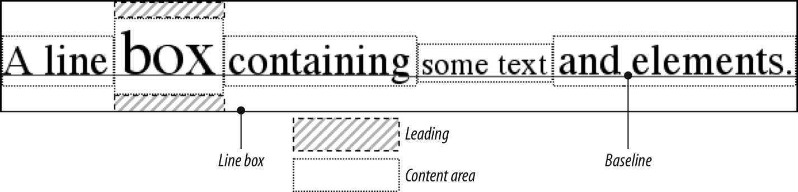
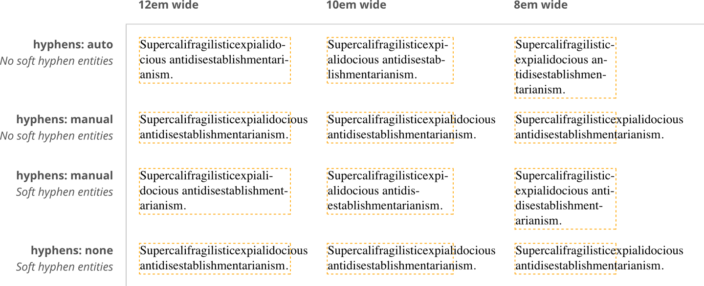

# 文本属性

文本是内容，字体是用来显示内容的

## 缩进和行内对齐
1. block 方向和 inline 方向，大部分语言从上至下，从左至右
2. `text-indent` 用于块级元素，缩进发生于 inline 方向，值为`长度|百分比`，只缩进第一行
3. If you want to “indent” the first line of an inline element, you can create the effect with left padding or margin.
4. 使用百分比值时，相对于包含块（父元素）的宽度
5. `text-align`: `start | end | left | right | center | justify | match-parent | start end`
6.  用于块元素，CSS Text Module Level 3 默认为 `start`
7. `text-align-last`: `auto | start | end | left | right | center | justify`，用于块级元素的每个换行位置的前一行的对齐（浏览器支持）

## 行内对齐

1. `line-height` 设定文本 baseline 之间的间距，`<number> | <length> | <percentage> | normal`，百分比值时相对 font-size
2. leading，line-height 和 font-size 的差值
3. 用于块级元素时，定义的是元素文本 baseline 的最小间距
4. `line-height` 减去 `font-size` 的值等分两半放在 content area 上下，可为负值
5. A line box is exactly as tall as needed to enclose the top of the tallest inline box and the bottom of the lowest inline box.
6. `line-height` 默认 `normal`，用户代理设置，一般约为 font-size 的1.2倍；line-height 继承具体的值或比率 (补：严重依赖 font-families 自身设置)
7. `vertical-align` 用于行内元素和 image、input 等替换元素、table-cells等，不继承，使用百分比值时相对于 `line-height`
8. Remember: `vertical-align` **does not** affect the alignment of content within a **block-level** element. You can, however, use it to affect the vertical alignment of elements within table cells.
9. `vertical-align: baseline` 强制元素的 baseline 和父元素的 baseline 对齐，图片、input 等没有 baseline 的将底部对齐父元素 baseline，even if there is no other text in the line.
10. `vertical-align`: `sub`、`super`，baseline 低于或高于父元素 baseline，具体数值由用户代理决定，此值不改变 font-size
11. `vertical-align: bottom` 把元素的 inline box 的底部与 line box 的底部对齐
12. `vertical-align: text-bottom` 元素的 inline box 的底部与默认 text box 的底部对齐，默认 text box 由父元素的 font-size 确定
13. `vertical-align`: `top` `text-top` 与 `bottom` `text-bottom` 相反
14. `vertical-align: middle` 元素的垂直中线与父元素 baseline 向上 1/4 em（1/2 ex）处对齐，常用于图片，baseline 向上的距离由用于代理决定，理论上可能有所不同
15. `vertival-align` 百分比值，元素 baseline 相对父元素 baseline 提升或降低（负值），百分比是相对于当前元素（非父元素）的 line-height
16. `vertival-align` 长度数值，基于本位置提升或降低指定的长度值
17. 设置 `vertival-align`，使得元素有自己的 inline box，会影响 line box 的高度

## Word Spacing and Letter Spacing
1. `word-spacing` 并不总是能识别不同语言中的“word”
2. `word-spacing` 和 `letter-spacing` 会继承，但无法像 `line-height` 那样设置一个相对值

## Text Transformation
1. `uppercase | lowercase | capitalize | none`，`capitalize` 视用户代理实现为`'Heading-one'` 或 `'Heading-One'`

## Text Decoration
1. `none | [ underline ‖ overline ‖ line-through ‖ blink ]`
2. 可联合使用: `h2 {text-decoration: underline overline;}`
3. 元素非继承，但子元素无法使用 `none` 清除父元素的 `underline` 等，决定于用户代理

## Text Rendering

## Text Shadows
1. `none | [<length> ‖ <length> <length> <length>?]#`
2. 两个 length，表示水平和垂直 offset，第三个可省略，模糊半径：从阴影外边缘到模糊范围边缘，具体的模糊方法由用户代理决定
3. 特大范围阴影可能造成性能问题

## 处理空格
1. `white-space` 设置浏览器对待 word 和 line 之间的空格的方式，CSS2.1 之前用于块级元素，之后用于所有元素
2. XHTML 多个空格合成一个，忽略元素中的换行
3. `white-space: normal;` 删除多余空格，换行转换成空格，同一行的多个空格变成一个
4. `white-space: pre;` 像 XHTML中的 `<pre>`，不忽略空格
5. `white-space: nowrap;` 防止wrap，只有使用 ` ` 才能换行，参照 HTML4 的 `<td nowrap>`
6. `tab-size: <length> | <integer>`  tab 占几个空格，用于块级元素，继承
7. `white-space`设置了合并空格，`tab-size`会被忽略，还会被计算但不可见
8. 目前 WebKit and Gecko (as –moz-tab-size) 只支持 `Integer`

| value | Whitespace | Line feeds | Auto line wrapping |
----|----|----|----
pre-line | Collapsed | Honored | Allowed
normal | Collapsed | Ignored | Allowed
nowrap | Collapsed | Ignored | Prevented
pre | Preserved | Honored | Prevented
pre-wrap | Preserved | Honored | Allowed

## Wrapping and Hyphenation (包裹和断字)

1. `hyphens` 决定 word 在何处 break，高度依赖具体语言
2. `word-break`: `normal | break-all | keep-all`
3. soft wrap 指文字太长，由用户代理或 OS 决定换行，`word-break` 可修改行为（换行符、` ` 为 hard wrap）
4. `break-all` 时不显示 hyphens（`line-break`属性会影响行为）
5. `keep-all` 去除所有单词中的 soft wrap，行为类似 `white-space: pre;`
6. `line-break`，As we just saw, `word-break` can affect how lines of text are soft wrapped in CJK text. The `line-break` property also affects such soft wrapping, specifically how wrapping is handled around CJK-specific symbols and around non-CJK punctuation (such as exclamation points, hyphens, and ellipses) that appears in text declared to be CJK.
7. `overflow-wrap / word-wrap`: `normal` `break-word`
8. `break-word` 和 `word-break: break-all` 的区别： `word-wrap: break-word` 当有可能使用空白断行时会使用而不会断词， `word-break: break-all `不管这些，会直接断单词

## Writing Modes
1. `writing-mode`: `horizontal-tb | vertical-rl | vertical-lr`，一些细节：block 方向和 inline 方向
2. `text-orientation` 字体方向
3. direction: `ltr | rtl`

